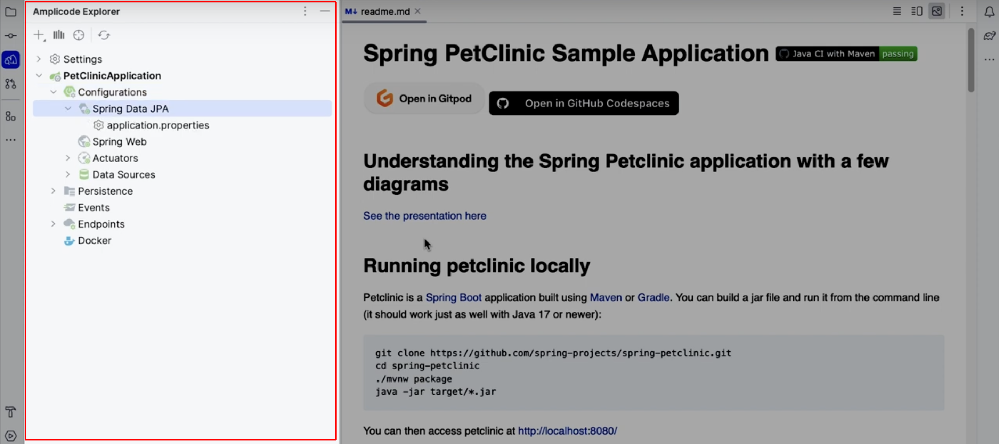
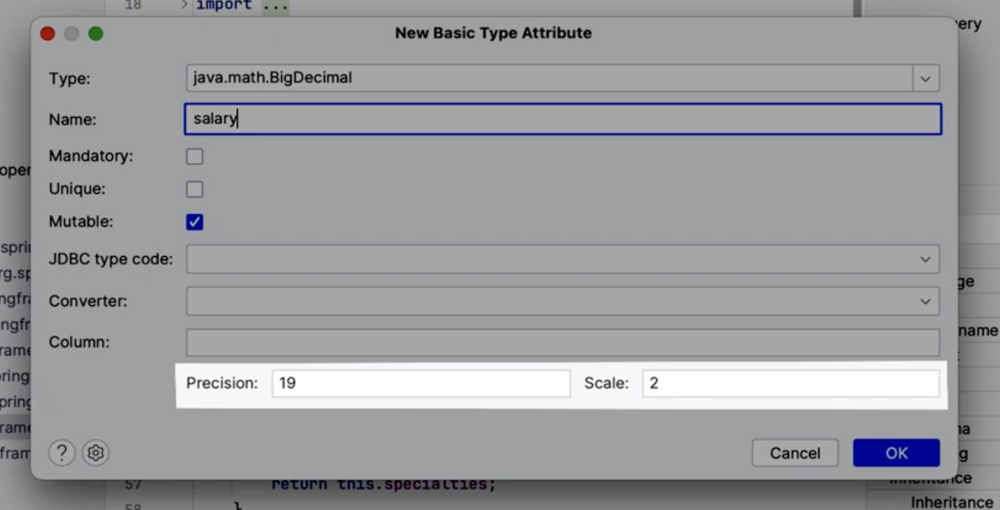
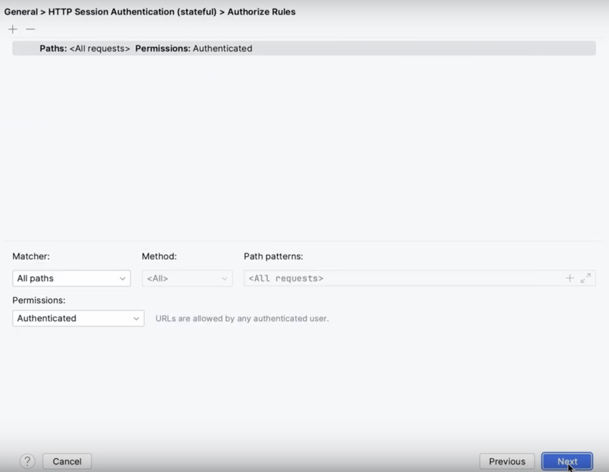
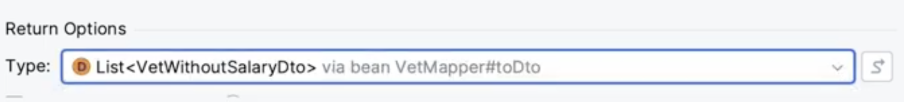
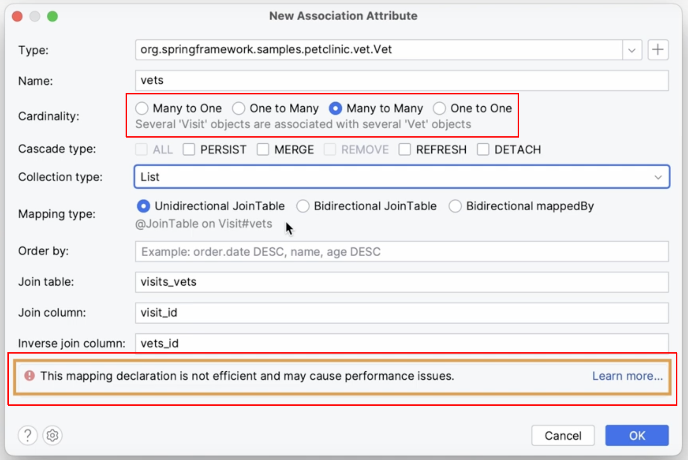
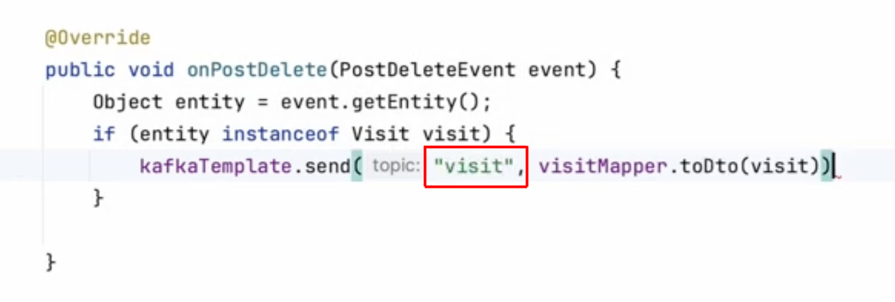
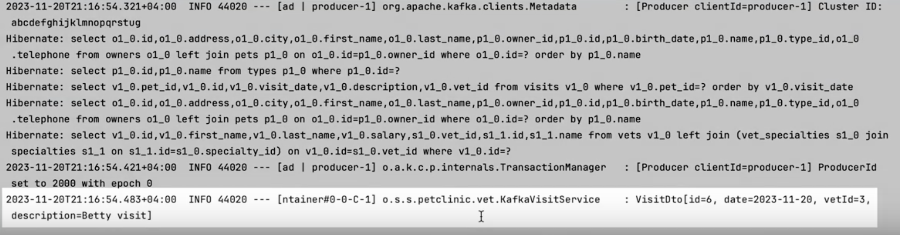

# Amplicode для разработки Spring Boot (Security + Web + Data + Flyway + Kafka) приложения

В этом гайде мы расскажем, как сделать существующее приложение (Spring PetClinic) готовым к продакшен, переехав с H2 и инициализировать базу данных посредством стандартного механизма Spring на PostgreSQL и Flyway; как реализовать учет заработных плат сотрудников, расширив существующую модель данных и изменив пользовательский интерфейс; как подготовить приложение к разработке мобильного клиента реализовав REST эндпоинты для получения списка ветеринаров, а также списка ветеринаров с возможностью фильтрации их по специальностям; 
как реализовать автоматическое назначение ветеринаров новым визитам, а также как настроить оповещение сотрудников о новых визитах через интеграцию с внешним сервисом, используя Kafka.

Для того чтобы следовать лучшим практикам, все сервисы, как и наше Spring Boot приложение, мы опишем в качестве контейнеров в файле Docker Compose. 

[](https://www.youtube.com/watch?v=g5kzePtZ9FQ)

**Примерное время прочтения: 30 минут.**

## Введение

Amplicode - это набор инструментов для максимально эффективной и комфортной разработки сервисов и веб приложений на Spring Boot в IntelliJ IDEA и административного пользовательского интерфейса на React Admin в VSCode. 

Amplicode предоставляет мощную поддержку фреймворка Spring для пользователей IntelliJ IDEA, включая популярные модули, такие как Spring Boot, Spring Web, Spring Data, Spring Security и другие. Также Amplicode облегчает использование связанных с экосистемой Spring технологий, таких как Liquibase и Flyway, MapStruct и Model Mapper, Lombok, Kafka и многих других. 

Кроме того, Amplicode помогает в написании Docker и Docker Compose файлов, что может значительно облегчить процесс разработки и разворачивания приложения для тестирования или демонстрации. А для разработки frontend доступна поддержка React Admin на TypeScript в VSCode. 

К ключевым задачам Amplicode, с которыми он успешно справляется, относятся: 
* Ускорение разработчика на всех этапах с целью повышения его эффективности
* Снижение порога входа в поддерживаемые технологии для новичков
* Углубление познаний разработчиков в области corner/edge кейсов
* Придание уверенности в том, что написанный код следует лучшим практикам
* Дополнение GitHub Copilot и IntelliJ IDEA AI

Стоит отметить, что за разработкой Amplicode стоит команда с богатым опытом, насчитывающим десятилетия, и успешными продуктами с многомиллионной аудиторией. Также Amplicode гарантирует увеличение скорости создания приложений до 80%, а общей производительности команды разработчиков на 30%. 

А теперь давайте посмотрим на Amplicode в действии. 

## Установка Amplicode

Для того чтобы установить Amplicode: 
* Откройте IntelliJ IDEA 
* Перейдите в секцию **Plugins**
  
* Нажмите на иконку шестеренки и выберите пункт **Manage Plugin Repositories**
  
* В открывшемся окне укажите ссылку на репозиторий Amplicode
```asciidoc
https://amplicode.ru/jetbrains-marketplace
```

* Находясь на складке **Marketplace**, впишите в поле ввода `Amplicode` и нажмите кнопку **Install**.
  
* Перезапустите IntelliJ IDEA
  

## Обзор существующего приложения (через Amplicode Explorer)

Давайте посмотрим, как Amplicode может помочь в разработке уже существующего Spring Boot приложения. В качестве примера возьмем довольно популярный проект Spring PetClinic. Откройте его в IntelliJ IDEA. В момент первого открытия приложения Amplicode необходимо активировать. 


После успешной активации все возможности Amplicode станут доступны. Amplicode предоставляет возможность проанализировать приложение в контексте используемых вреймворков и библиотек с помощью панели Amplicode Explorer. 



С помощью этой панели можно узнать следующее:

* Какие модули подключены к проекту 
* Что из себя представляет слой данных 


* Какие эндпоинты доступны в проекте
* Какие файлы, необходимые для развертывания приложения, уже есть в проекте 

Исходя из знаний Amplicode о нашем проекте, можно сделать следующие выводы:

1. Для удобной работы с персистентным слоем в приложении используется модуль Spring Data JPA.
   
2. К проекту подключены стартеры Spring Web и Actuator
   
3. В качестве хранилища данных используется встроенная база данных H2
   
4. Мы можем более детально ознакомиться с моделью данных нашего приложения, посмотреть, какие основные сущности объявлены в проекте, а также каким образом они связаны друг с другом
   
5. Все доступные MVC и REST эндпоинты могут быть просмотрены в наиболее удобном для нас виде
   

Структура проекта стала более понятной. Приступаем к реализации поставленных задач.

### H2 -> PostgreSQL

Первым шагом станет замена встроенной базы данных H2 на PostgreSQL. Amplicode старается придерживаться подходов, с которыми многие разработчики уже давно знакомы, как, например, двойной клик, нажатие правой кнопкой мыши или комбинация клавиш для открытия файла. Amplicode с очень высокой вероятностью поймет любое из этих действий на большинстве визуальных элементов.

Нас интересует источник данных. Чтобы обратиться  к этому элементу в дереве, выполните двойной клик на dataSource. 


В открывшемся окне необходимо выполнить следующие действия:
* Изменить тип базы данных 
* Указать необходимые параметры, такие как хост, порт, название базы данных, имя пользователя и пароль. 
* Нажать **ОК**


Важно отметить, что Amplicode не только обновил значения свойств в файле `application.properties`, но также добавил необходимую зависимость для взаимодействия с базой данных PostgreSQL из нашего приложения. 


Благодаря панели Amplicode Designer, появляется возможность определить, какие еще свойства, помимо уже объявленных, могут быть использованы в приложении. Например, можно обратить внимание, что для группы Spring JPA доступно такое свойство как Auto DDL. 


Благодаря использованию этого свойства со значением `validate`, можно убедиться в том, что JPA модель полностью соответствует схеме, заданной в базе данных. 


Также мы можем обратить внимание, что нам доступно свойство Show SQL. Установите это свойство в `true` для удобства отслеживания того, какие именно запросы отправляются в базу данных. 


Осталось только изменить тип базы данных в свойстве `database` на `postgres`. 


Использовать локально поднятые сервисы в современных реалиях является дурным тоном. Из-за использования локальных сервисов возникают проблемы с переносимостью и настройкой окружения каждым из разработчиков на проекте. Намного лучше описать все необходимые сервисы в файле Docker Compose. Используя такой подход, нам достаточно иметь установленный локально Docker либо его аналог. За все остальное можно будет не переживать. 

Amplicode содержит узел Docker в панели Amplicode Explorer.


С его помощью вы можете создать файл Docker Compose. Для этого нажмите правую кнопку мыши на узле Docker.


В открывшемся файле добавьте необходимый нам сервис из числа доступных, воспользовавшись панелью Amplicode Designer, Editor Toolbar или же действием Generate от IntelliJ IDEA. 


Amplicode воспользовался уже существующим подключением к базе данных и подставил все необходимые значения в обязательные поля. 


Любой из параметров можно менять в случае необходимости, но на текущем этапе вам этого делать не нужно. Достаточно просто нажать **ОК**. Сервис готов.


Запустите базу данных, а затем и приложение, чтобы убедиться, что все работает, как и прежде.

Для запуска базы данных нажмите на значок двойной стрелочки в файле `docker-compose.yaml`.


Первый шаг - переезд на PostgreSQL - успешно осуществлен. 

## Подключение Flyway. Генерация скрипта инициализации БД

Следующий шаг - добавление инструментов версионирования баз данных. Помимо исследования доступных свойств с помощью Amplicode Designer, мы можем настроить свойства, которые на данном этапе нам пока недоступны ввиду отсутствия необходимых зависимостей. Например, в секции **DB Migration** можно обнаружить необходимый для дальнейшей работы **Flyway**. 


Стоит отметить, что, помимо Flyway, Amplicode может облегчить нам работу и с Liquibase. Все возможности, описанные в этом разделе, доступны также и для тех, кто предпочитает использовать Liquibase.

Для подключения и настройки Flyway необходимо выполнить описанные ниже действия.

* Оставьте значение префикса-сепаратора и расположение директории, которая будет содержать сгенерированные скрипты, по умолчанию. 


* Поскольку мы больше не будем использовать встроенные возможности Spring для создания таблиц, нам потребуется скрипт инициализации базы данных. 


* В качестве источника данных следует выбрать базу данных, так как она была успешно проинициализирована и заполнена необходимыми данными на предыдущем шаге. 


* Для того чтобы Amplicode смог прочитать структуру базы данных и сгенерировать скрипт инициализации, необходимо создать новое подключение либо выбрать уже существующее. 


* Нажмите **ОК**.

* Amplicode сгенерирует скрипты инициализации базы данных. Прежде чем сохранить их, следует убедиться, что они соответствуют нашим ожиданиям.


Скрипт инициализации базы данных готов. Ранее существовавшие скрипты инициализации базы данных при наполнении ее данными больше не понадобятся, поэтому необходимо удалить те свойства, которые на них ссылаются. 


На этом настройка Flyway успешно завершена. Модно переходить к следующему шагу.

## Изменение модели: добавление базового атрибута

Следующей задачей является реализация учета заработных плат сотрудников. Для этого прежде всего необходимо расширить существующую модель данных, а именно добавить поле, содержащее информацию о зарплате, в сущность `Vet`. 

Воспользуйтесь панелью Amplicode Designer (**Attributes** -> **Basic Type**) либо панелью **Generate** от IntelliJ IDEA, в которой необходимо выбрать пункт **Entity Attribute**.


В открывшемся окне можно полностью настроить атрибут. Прежде всего, необходимо правильно выбрать тип для нового аттрибута. Хорошей практикой при работе с денежными типами данных в Java является использование `BigDecimal`.


 В зависимости от выбранного типа, Amplicode предоставляет дополнительные параметры настройки атрибута. В данном случае это **Precision** и **Scale**. 



Оставьте их значения как предложено по умолчанию и нажмите **OK**. Атрибут готов. 

Если обратить внимание на панель Amplicode Designer, то можем увидеть, что нам доступна секция **Validation**, так как в приложении используется одноименный стартер. 


Amplicode знает об этом и позволяет нам выбрать нужные валидации из множества доступных для конкретного атрибута, не обращаясь к поиску в интернете или чтению документации.

Логичной валидацией в данном случае будет `@PositiveOrZero`. Выберите ее, и Amplicode добавит соответствующую аннотацию. 


Теперь необходимо внести соответствующие изменения в пользовательский интерфейс, добавив новое поле. 


Половина из всех поставленных задач выполнена. Запустите приложение, чтобы убедиться, что все работает должным образом. Приложение не запустилось и выдало ошибку, но почему?


Причина заключается в том, что мы добавили новое поле на уровне JPA, но забыли написать соответствующий скрипт для добавления этой колонки в базу данных. Благодаря свойству Hibernate `ddl-auto` со значением `validate` мы обнаружили это несоответствие сразу при запуске приложения. 

Amplicode позволяет вызвать действие по синхронизации модели с базой данных прямо из stacktrace. Для этого нажмите на помеченную на рисунке ниже ссылку:


Появится следующее всплывающее окно:


Проверьте, что выбраны корректный persistence unit и подключение к базе данных и нажмите **ОК**. 

Среди всех скриптов, которые мы видим в окне предпросмотра, можно найти тот самый скрипт, который мы забыли написать для новой колонки. Однако, помимо этого скрипта есть еще более 10 скриптов, которые мы не ожидали увидеть. Давайте разберемся, в чем же дело. 


Ранее мы использовали скрипты, в которых не указывали длину для колонок с текстом. Однако, в JPA, когда мы используем аннотацию `@Column`, по умолчанию будет выставлена длина 255. Amplicode об этом знает и предлагает модифицировать длину существующих колонок. Так как подобное изменение может привести к потере данных, то есть, те данные, которые выходят за границу 255 символов, будут удалены, Amplicode подсвечивает нам все эти скрипты красным цветом, так как к ним требуется особое внимание со стороны разработчика. 


Если говорить о цветовой раскраске, то бывают еще скрипты, которые Amplicode отмечает желтым и зеленым цветами. По аналогии с красными скриптами, желтые могут быть потенциально опасны, а вот зеленые абсолютно безопасны и не смогут привести к потере данных. 


Остальные изменения, которые мы видим, точно так же появились здесь ввиду различий между JPA моделью и базой данных, которые, видимо, накопились за долгое время существования проекта. 

Эти изменения выходят за рамки текущих задач,  поэтому перенесите их в секцию Ignored. Для этого:

* Пометьте все переносимые скрипты
* Нажмите правую клавишу мыши
* Во всплывающем меню выберите **Remove and Ignore**


Amplicode запомнит все эти изменения и не будет предлагать их при последующих генерациях скриптов.

Наконец, можно заметить, что в этой секции уже были некоторые скрипты. Например, скрипт по удалению индекса из базы данных. Amplicode заранее разместил эти скрипты в секцию Ignored. 


Такой подход выглядит довольно логичным, так как создание индекса может быть довольно дорогостоящей операцией, а его объявление на уровне модели JPA не является довольно распространенным. Поэтому удалять его мы вряд ли захотим.

Теперь скрипт нас полностью устраивает. Назовите  его `V1__add_salary` и перезапустите приложение. У ранее созданных ветеринаров отсутствует значение для поля зарплаты. Для проверки корректности реализованной функциональности необходимо проинициализировать поля рандомными значениями. Это можно сделать из вкладки local как показано на рисунке ниже:


Теперь все должно работать, корректно.


## Подключение и настройка Spring Security

Давайте проанализируем, что мы уже сделали. Решив предыдущую задачу, мы столкнулись с небольшой проблемой безопасности. Теперь абсолютно все, даже неаутентифицированные пользователи, могут просматривать информацию о зарплатах сотрудников. Давайте сделаем так, чтобы эту информацию могли видеть только аутентифицированные пользователи. Для этого добавим Spring Security  и настроим доступ к эндпоинту.

Amplicode позволяет добавить и настроить Spring Security через панель Amplicode Explorer. Для этого неоьходимо выбрать **Add Configuration** -> **Spring Security Configuration**.  


Интуитивно понятные диалоговые окна позволяют настроить один из множества наиболее популярных способов аутентификации и дополнительные параметры, специфичные для каждого из типов. 


В данном случае подойдет базовый механизм Spring Security **HTTP session authentication**. Поэтому:

* Отметьте соответствующий радио баттон и нажмите **Next**


* Оставьте все параметры по умолчанию (в дальнейшем их можно будет изменить, если потребуется); нажмите **Next**


* Убедитесь в правильности настроек и нажмите **Next**



* На последнем шаге можно увидеть, какие новые зависимости будут добавлены к проекту, затем необходимо нажать **Create**


Конфигурационный класс для Spring Security готов. Перезапустите приложение, чтобы убедиться в том, что теперь информацию о ветеринарах смогут видеть только аутентифицированные пользователи.

## Модификация существующего REST эндпоинта

Помимо MVC эндпоинтов в нашем приложении также существует один REST эндпоинт, который могут использовать наши внешние клиенты для получения информации о ветеринарах (класс `Vets`, исходный код приведен ниже). 

```asciidoc
@XmlRootElement
public class Vets {

	private List<Vet> vets;

	@XmlElement
	public List<Vet> getVetList() {
		if (vets == null) {
			vets = new ArrayList<>();
		}
		return vets;
	}

}
```

В качестве возвращаемого значения здесь используется список сущностей. Как следствие, каждое изменение в модели, такое как добавление зарплаты или любого другого поля, будет отражаться и на клиентах. И этого мы, конечно же, не хотим.

Наиболее распространенным решением этой проблемы является использование DTO в качестве возвращаемого типа. Давайте просто изменим возвращаемый тип на не существующий пока что `VetWithoutSalaryDto`. 

```asciidoc
@XmlRootElement
public class Vets {

	private List<VetWithoutSalaryDto> vets;

	@XmlElement
	public List<VetWithoutSalaryDto> getVetList() {
		if (vets == null) {
			vets = new ArrayList<>();
		}
		return vets;
	}

}
```

Amplicode понял, что мы хотим сделать, и позволяет нам вызвать диалог создания DTO прямо отсюда (нажмите **Alt+Enter** для Windows/Linux или **⌥+Enter** для macOS). 


Далее:

* Выберите сущность для DTO 


* Создайте абстрактный интерфейс, нажав на ссылку **Add MapStruct DTO mapper dependency to project**:


* Сделайте DTO мутабельным и выберите все поля, кроме зарплаты


Для ассоциативного поля специальностей Amplicode также предлагает создать DTO. Поэтому:

* Создайте DTO для специальностей прямо в текущем объекте, выбрав тип **New Nested Class**. 


* Нажмите **OK**

DTO и MapStruct интерфейс готовы к использованию. Исходный код MapStruct интерфейса приведен ниже:

```asciidoc
@Mapper(unmappedTargetPolicy = ReportingPolicy.IGNORE, componentModel = MappingConstants.ComponentModel.SPRING)
public interface VetMapper {
	Vet toEntity(VetWithoutSalaryDto vetWithoutSalaryDto);

	VetWithoutSalaryDto toDto(Vet vet);

	@BeanMapping(nullValuePropertyMappingStrategy = NullValuePropertyMappingStrategy.IGNORE)
	Vet partialUpdate(VetWithoutSalaryDto vetWithoutSalaryDto,
					  @MappingTarget Vet vet);
}
```

Теперь нам осталось только преобразовать список возвращаемых сущностей в список DTO в классе `VetController`. Благодаря Java Stream API мы можем это сделать довольно элегантно, а благодаря IntelliJ IDEA мы можем сразу начать писать необходимый оператор вместо предварительного преобразования списка в поток. IDE выведет список подсказок для нашего удобства.


Помимо встроенных вариантов от IntelliJ IDEA, мы можем также сразу заметить новую опцию `mapToVetWithoutSalaryDto` от Amplicode, которая выглядит как именно то, что мы и хотим сделать. Выберите этот вариант. Помимо того генерации кода для преобразования сущности в DTO, мы также получим корректно заинжектированный Bean маппера в наш контроллер. 


Последнее, что осталось сделать - предоставить доступ к нашему эндпоинту всем без исключения. Amplicode позволяет нам сделать это прямо из исходного кода контроллера. В IntelliJ IDEA практически все визуальные элементы являются кликабельными. Иконки, предоставляемые Amplicode, не являются исключением.  


Кликните на иконку замочка, нажмите на **Add Authorize Rule** и добавьте правило авторизации. Нажмите **OK**.


Amplicode внесет изменения в существующие параметры доступа к эндпоинту. 

```asciidoc
		http.authorizeHttpRequests(authorizeHttpRequests -> authorizeHttpRequests
			.requestMatchers(HttpMethod.GET, "/vets").permitAll()
			.anyRequest().authenticated());
```

Перезапустите  приложение и убедимся в том, что все работает корректно. Теперь все приложение доступно только аутентифицированным пользователям, а наш единственный REST эндпоинт - всем без исключения.


## Создание REST-контроллера с нуля

Как мы уже успели заметить ранее, в нашем приложении большинство эндпоинтов реализовано по принципу MVC, и только один из них - REST эндпоинт, объявленный прямо в контроллере MVC. 


На самом деле, это не лучшая практика. Поэтому наша следующая задача - подготовить приложение к интеграции с мобильным клиентом, создав отдельный REST контроллер для REST эндпоинтов. 

Для этого: 
* Прямо в дереве проекта вызовите действие **REST Controller** от Amplicode нажатием правой кнопки мыши


* В открывшемся окне укажите название контроллера, пакет, в котором он будет создан, и путь, по которому он будет доступен 


* Нажмите **OK**

По сути, эндпоинты, которые мы хотим реализовать, являются делегацией методов из репозитория. Amplicode предоставляет специальный диалог для делегирования любых методов из любых Bean'ов, существующих в проекте. 


Amplicode автоматически выбрал интерфейс `VetRepository` в качестве источника для делегирования. Это как раз то, что нам нужно. 


Начнем с настройки метода, отвечающего за делегирование метода `findAll`. Его название, путь и тип запроса выбраны автоматически именно такие, которые нам и нужны. 


Единственное, что нам нужно изменить - это возвращаемый тип. Как мы уже говорили ранее, возвращать сущность - не лучшая идея. Можно создать новую DTO и маппер к ней прямо отсюда либо воспользоваться уже существующей DTO. Используйте вторую опцию, так как у нас уже есть класс `VetWithoutSalaryDto`. 


Перед закрытием диалога можно предварительно посмотреть код, который будет сгенерирован, чтобы убедиться, что все сделано верно. Помимо самого метода, Amplicode также инжектирует необходимые Bean'ы в контроллер. 


Нажмите **OK**.

Второй метод, который необходимо реализовать - это метод для получения ветеринаров только определенной специальности. Для этого понадобится добавить новый метод в репозиторий. 

Перейдите к классу `VetRepository` и создайте метод поиска коллекции сущностей, используя панель Generate от intelliJ IDEA. 


В качестве параметра запроса укажите специальности, а в качестве оператора поиска -  условие `in`. Нажмите **OK**. 


Метод готов, и теперь следует делегировать его прямо в контроллер, воспользовавшись опцией **Delegate to** из панели Editor Toolbar.


В открывшемся окне выберите тот контроллер, в который мы хотим делегировать данный метод. 


Следующее, что нужно сделать - настроить параметры метода контроллера. Мы реализовали метод по поиску ветеринаров, принадлежащих к определенной специальности. 


Подобная реализация крайне понятна в использовании, а также более поддерживаема в дальнейшем ввиду наличия типизации. Но, реализуя REST эндпоинт, нам бы хотелось получать всех ветеринаров, принадлежащих к определенным специальностям, указывая только их идентификатор. Amplicode прекрасно понимает, что такое требование является довольно распространенным, и предоставляет удобный способ его реализации. 

В выпадающем списке для параметров метода `Specialties` выберите метод уже существующего репозитория `SpecialtyRepository`, который обернет полученный из запроса идентификатор в прокси-объект без дополнительных запросов в базу данных. 


Аналогично ранее созданному эндпоинту, измените возвращаемый тип на DTO и нажмите **OK**. 



Укажите путь к эндпоинту, воспользовавшись панелью Amplicode Designer. 


Отлично! Все, что нам осталось сделать - настроить Spring Security, сделав все REST эндпоинты общедоступными. Для этого воспользуйтесь замочком над классом и выберите в качестве правил доступа значение `Permit all`. 


### Тестирование эндпоинта

Есть довольно много способов протестировать работоспособность нашего кода. Можно было бы обратиться к эндпоинтам через стороннего HTTP клиента вроде Postman, через браузер, как мы это делали ранее или через `curl` команды прямо из терминала. Но с Amplicode для нас открывается еще одна возможность реализовать проверку, пожалуй, еще более быстрым способом и еще более полезным в дальнейшем. А именно, используя `@WebMvcTest`. 

На самом деле, тема тестирования довольно обширная и выходит за рамки наших сегодняшних целей. Более подробно мы расскажем о том, как Amplicode может помочь вам в тестировании Spring Boot приложения, в одном из следующих видео. А сегодня давайте сгенерируем тесты, которые позволят нам убедиться в том, что наши REST эндпоинты возвращают нужный статус. 

* Откройте меню Generate от IntelliJ IDEA 
* Создайте новый тестовый класс


* В качестве тестового контекста выберите Spring Boot Application. 


* Пометьте оба метода как тестируемые  
* Отключите CSRF 


* Настройте входные параметры для метода поиска по специальности как показано на рисунке. 


* Нажмите **OK**. 

Чтобы запустить тесты, воспользуйтесь специальной иконкой в исходном коде тестового класса:


Если тесты прогнались удачно, вы должны увидеть примерно следующую картину:


## Изменение модели: добавление ассоциативной связи

Следующей задачей, которую предстоит решить, является реализация логики по автоматическому назначению ветеринара новому визиту. Для того чтобы реализовать подобную функциональность, сначала нужно вновь расширить существующую модель, добавив ассоциативную связь "Многие к одному" от визита к ветеринару. Воспользуйтесь уже знакомым нам действием по добавлению нового атрибута. В качестве типа атрибута укажем ветеринара. 


Все параметры в данном случае нас полностью устраивают. Стоит отметить, что Amplicode позволяет создавать любой тип ассоциативной связи; более того, он всегда сможет подсказать вам, какая из реализаций будет дучше в плане производительности, благодаря умным подсказкам.

**Пример:**


Однако, в данном случае вам надлежит оставить все параметры без изменений и просто нажать **OK**.

Атрибут готов. Не забудьте внести изменения на UI, а также сгенерировать скрипт миграции. 

## Написание бизнес логики

Бизнес логику в Spring приложениях принято реализовывать в классах, помеченных аннотацией `@Service`. Давайте создадим такой класс. Помимо обычного класса, среди доступных опций можем обратить внимание на отдельно стоящий элемент **Spring Service** от Amplicode. Давайте им и воспользуемся. Нажмите на Spring Service в меню New, как показано на рисунке.


В появившемся окне введите имя класса и нажмите **OK**.


Amplicode создаст пустой класс под реализацию бизнес логики.

Логика нахождения подходящего ветеринара будет довольно простой. В случае, если у питомца уже были визиты в клинику, то выберем последнего ветеринара, работавшего с питомцем. В случае же, если визитов ранее не было, будем назначать любого из ветеринаров с профессией хирурга. 

Давайте приступим к реализации. Сначала надо получить список визитов переданного питомца. Если список пуст, то нам нужно найти любого из ветеринаров с идентификатором специальности, равным идентификатору специальности "Хирург". Для этого обратимся к интерфейсу `VetRepository` и попробуем найти подходящий метод. Вместе с Amplicode нам не нужно думать о том, какие Bean'ы уже заинжектированы в текущий сервис, а какие нет. Мы можем начать писать имя нужного нам Bean, выбрать его из списка, а Amplicode сделает все необходимое для того, чтобы мы смогли им воспользоваться.   


Среди существующих методов репозитория нам ни один не подходит. Однако есть возможность создать новый метод прямо отсюда благодаря действию `find` с многоточием. 


В качестве типа репозитория выберите тип поиска коллекции сущности. 


Amplicode откроет диалог создания нового метода в уже существующем репозитории. Для этого даже не требуется покидать текущий редактор кода. Нажмите на ссылку **Add query condition**.


Чтобы реализовать поиск ветеринара по `id` специальности: 
* Нажмите на икону с тремя точками в колонке **Attribute** в таблице


* Выберите поле `id` из списка


* Выберите условие `in` из списка в колонке **Condition**


* Нажмите **OK**

Метод в репозитории создан, и его вызов сгенерирован в нашем сервисе. Осталось только реализовать логику нахождения ветеринара, работавшего последним с нашим питомцем. Финальный код метода будет иметь следующий вид:

```asciidoc
@Service
public class VetAutoAssignmentService {

	public static final int SURGERY_ID = 2;
	private final VetRepository vetRepository;

	public VetAutoAssignmentService(VetRepository vetRepository) {
		this.vetRepository = vetRepository;
	}

	public Vet findAppropriateVet(Pet pet) {
		List<Visit> visits = pet.getVisits()
			.stream()
			.toList();
		if (visits.isEmpty() || visits.stream()
			.noneMatch(v -> v.getVet() != null)) {
			return vetRepository.findBySpecialties_IdIn(Collections.singleton(SURGERY_ID))
				.stream()
				.findAny()
				.orElseThrow();
		}
		return visits.stream()
			.filter(v -> v.getVet() != null)
			.max(Comparator.comparing(Visit::getDate))
			.orElseThrow()
			.getVet();
	}
}
```

Сервис готов к использованию. Давайте воспользуемся Amplicode Explorer, чтобы быстро найти эндпоинт для создания нового визита. Скорее всего, в пути к подобному эндпоинту должны содержаться слова visit и new. Действительно, подобный POST эндпоинт существует в проекте. 


Первым делом обратимся к нашему сервису по имени vetAutoAssignmentService`

```asciidoc
vetAutoAssignmentService.findAppropriateVet(pet);
```

В текущем эндпоинте у нас еще нет объекта `pet`, есть только его идентификатор. Давайте аналогичным образом заинжектируем репозиторий для сущности `Pet` и обратимся к методу `getReferenceById`, чтобы обернуть идентификатор в объект. 

Начните писать petRepository.
Оказывается, у нас в проекте еще не было репозитория для сущности `Pet`. Несмотря на это, Amplicode понял, что именно мы хотим сделать, и вывел всплывающее окно, позволяющее совместить сразу несколько действий в одно: создание нового репозитория, его инжекция и генерация обращений к нему.


Выберите `petRepository`. Появится следующее выплывающее окно:


Нажмите **OK**. Недостающий класс будет создан в проекте.

Amplicode настолько хорошо понимает наш проект, что предлагает заинжектировать даже еще не существующие Bean'ы. 

Обратимся к методу `getReferenceById`, чтобы получить объект. Передадим его в метод сервиса и наконец установим объекту `visit` выбранного ветеринара. 

```asciidoc
		Pet pet = petRepository.getReferenceById(petId);
		Vet vet = vetAutoAssignmentService.findAppropriateVet(pet);
		visit.setVet(vet);
```

Запустите приложение и попробуйте создать новый визит. 


Если все сделано правильно, ветеринар будет успешно назначен автоматически.


Еще одна задача решена. Можно двигаться дальше. 

## Подключение и настройка Kafka

Следующей задачей для нас будет настройка отправки сообщений в Kafka и их получение из нее. Для этого нам сначала нужно подключить саму Kafka к проекту. Давайте воспользуемся Amplicode Explorer, чтобы создать новую Kafka конфигурацию.
Для этого:

* Нажмите правой клавишей мыши на пункте **Configurations**
* Выберите **Add Configuration** и затем **Kafka Configuration**.


Создадим новый конфигурационный класс для настроек, связанных с Kafka, воспользовавшись для этого появившимся всплывающим окном. Для этого нажмите на иконку плюса рядом с полем **Configuration class** и затем в новом маленьком окошке нажмите **OK**. 


Далее, в качестве значения для идентификатора группы потребителей укажите `visit`, а все остальные параметры оставьте по умолчанию и нажмите **OK**.


Amplicode добавит необходимую зависимость, настроит значения в файле свойств и создаст все необходимые компоненты для новой конфигурации. Кроме того, Amplicode сразу же предложит нам добавить Kafka в качестве сервиса в Docker Compose. 


Воспользуйтесь этим предложением, нажав на соответствующую ссылку. Оставьте все настройки по умолчанию и нажмите **OK**. 

Запустите Kafka, чтобы убедиться, что все работает корректно. Для этого в файле `docker-compose.yaml` нажмите соответствующую иконку стрелочки.


### Отправка сообщений в Kafka

Теперь нам нужно настроить отправку сообщений в очередь после добавления, удаления и изменения визитов в базе данных. Для этого будет удобно воспользоваться Hibernate Event Listener, чтобы отслеживать изменения с помощью механизма, представленного Hibernate. 

Откройте меню создания новых элементов в дереве проекта и в разделе **Other** найдите **Hibernate Event Listener**. 


Далее:

* Переименуйте класс в `VisitHibernateEventListener`


* Выберите типы событий, на которые будет реагировать наш слушатель


* Укажите сущность 


* Нажмите **OK**


Класс-основа для слушателя будет сгенерирован.

Теперь осталось только реализовать логику отправки сообщений в очередь. 

Измените возвращаемое значение в методе `requiresPostCommitHandling` с `false` на `true`, чтобы разрешить Hibernate выполнять всю описанную выше логику после коммита. 


Снова придерживаясь уже известного правила о том, что лучше отправлять DTO, а не сущность, воспользуйтесь постфиксом `mapTo` для преобразования сущности в DTO. 


В качестве типа для DTO выберите **Java Record**, отметьте все базовые поля, а для ветеринара - только идентификатор, как показано на рисунке. 


Также, необходимо создать новый MapStruct интерфейс. 


Далее, нажмите **OK**, чтобы завершить генерацию кода для DTO.

Теперь необходимо воспользоваться еще одним постфиксом `send`, чтобы настроить отправку сообщений в очередь. 


После нажатия на send появится следующее диалоговое окно:


Нажмите **Next**.

Сериализаторы для ключа и значения выбраны правильно. 


Нажмите **Next**.

Надо изменить только конфигурационный класс, в котором будет зарегистрирован новый Kafka template. 


Выберите `KafkaConfiguration` из выпадающего списка и нажмите **Create**. 


Kafka template с нужными типами создан и уже внедрен в класс. 


Осталось только указать название очереди, в нашем случае, `visit`. 



При желании можете скопировать следующий код напрямую из текста гайда:

```asciidoc
kafkaTemplate.send("visit", visitMapper.toDto(visit));
```

Теперь скопируйте получившуюся строку в остальные обработчики событий. 


Отправка сообщений в очередь полностью настроена. 

### Получение сообщений из Kafka

Чтобы убедиться в том, что все работает, реализуем получение сообщений из брокера. Для того чтобы настроить получение сообщений из Kafka в Spring, необходимо создать новый сервис. Воспользуйтесь меню **New** и выберите **Spring Service**.


Появится диалоговое окно. Назовите новый класс `KafkaVisitService` и нажмите **OK**.


Новый класс будет сгенерирован и открыт в редакторе IDE.

Механизм получения сообщения Spring для Kafka реализуется через слушатель. Amplicode позволяет нам создать их с помощью Amplicode Designer. 


Нажмите на **@KafkaListener** и из выпадающего списка выберите **New Container**.


В открывшемся окне выберите тип ключа (`String`) и тип значения (`VisitDto`), затем нажмите **Next**. 


На данный момент оставьте без изменения сериализаторы, которые предлагает Amplicode, и в случае необходимости вы всегда сможете изменить их значения потом. Нажмите **Next**.

Выберите конфигурационный класс, в котором будет создан необходимый компонент. Для этого, аналогично тому, как это было сделано в предыдущем разделе, выберите `KafkaConfiguration` из выпадающего списка и нажмите **Create**.

Kafka слушатель готов. Для демонстрации достаточно просто залоггиовать то, что приходит из очереди с названием `visit`. Запустите приложение и создайте новый визит. 

Если все работает корректно, новый визит должен отобразиться в логах.



## Контейнеризация Spring Boot приложения

В качестве финального шага реализуем возможность запуска приложения также из Docker Compose. С Amplicode весь процесс не займет более двух минут. 

* В Amplicode Designer, Editor Toolbar или Generate menu выберите Spring Boot приложение.


* Образ будет создаваться из `Dockerfile`, который нам также предварительно потребуется создать, для чего воспользуйтесь иконкой "плюс" рядом с полем **Dockerfile**:


* Пометьте чекбокс **Include application build stage**, чтобы включить стадию сборки нашего приложения, а настройки Gradle оставьте по умолчанию 

* Нажмите **OK**

* В качестве зависимых сервисов выберите Postgres


* Нажмите **OK** еще раз

Теперь нужно изменить значения свойств в `application.properties`. Так как Kafka и Postgres больше не будут располагаться на localhost, для образа, поднятого в Docker, добавьте переменные окружения, чтобы указать валидные пути к сервисам. Для этого необходимо открыть файл `application.properties` и воспользоваться контекстным действием от Amplicode (нажмите **Alt+Enter** для Windows/Linux или **⌥+Enter** для macOS).


Пользуясь пунктом меню **Wrap property value with environment variable**, укажите значения, которые будут использоваться при запуске в Docker Compose.


Запустите приложение и проверьте, все ли работает, как прежде. Теперь, используя Docker Compose, вам не составит никакого труда задеплоить приложение для тестирования или демонстрации. 

## Заключение

Давайте вспомним еще раз, какие задачи были поставлены перед нами в этом гайде.

* Сделать приложение production-ready, а именно переехать с H2 и инициализировать базу данных посредством стандартного механизма Spring на PostgreSQL и Flyway в качестве системы версионирования базы данных
* Реализовать учет заработных плат сотрудников, расширив существующую модель данных и изменив пользовательский интерфейс (При этом важно будет сохранить обратную совместимость с имеющимся API, а также подключить и настроить Spring Security таким образом, чтобы информацию о зарплатах не могли получить все желающие)
* Подготовить приложение к разработке мобильного клиента, а именно, реализовать REST эндпоинты для получения списка ветеринаров, а также списка ветеринаров с возможностью фильтрации их по специальностям
* Реализовать автоматическое назначение ветеринаров новым визитам
* Настроить оповещение сотрудников о новых визитах через интеграцию с внешним сервисом, используя Kafka
* Описать все сервисы, как и Spring Boot приложение, в качестве контейнеров в файле Docker Compose

Мы реализовали все поставленные перед нами задачи менее чем за 30 минут. На самом деле, Amplicode содержит еще множество фич, которые просто не уместились в данный гайд. Если говорить о Spring Boot, то не были показаны, но также заслуживают внимания следующие возможности Amplicode:

* Поддержка Spring Data MongoDB
* Поддержка Spring Data JDBC
* Возможность создания JPA сущностей из таблиц базы данных
* Поддержка Spring Events и Spring Cloud
* И многое другое

Кроме помощи в написании backend, Amplicode также помогает и при разработке frontend, предоставляя:

* Создание React Admin модуля
* Генерацию типовых экранов для CRUD
* Помощь в разработке экранов на React Admin

Кроме того, мы также частично продемонстрировали поддержку деплоймента в данном видео. Но на самом деле она еще более обширная и включает в себя:

* Помощь при написании GitLab/GitHub CI actions
* Поддержку при разработке Kubernetes/Helm
* А также развертывание в облаке

В ближайшем будущем мы постараемся раскрыть озвученные ранее возможности в наиболее полном объеме в отдельных видео. А если вы заинтересовались Amplicode и хотите самостоятельно изучить его возможности, то присоединяйтесь к нашему Telegram каналу. Там вы найдете все необходимое для того, чтобы начать получать максимальное удовольствие от разработки вместе с Amplicode. 

