# Flyway + Spring Boot: Настройка и написание миграций баз данных

**Изучите, как подключить в проект и использовать Flyway для написания миграционных скриптов баз данных в приложении, написанном на Spring Boot с использованием Amplicode.**

[](https://www.youtube.com/watch?v=w-46xlGRcZk)

**Примерное время прочтения: 20 минут.**

## Введение
В процессе разработки приложения нам время от времени приходится вносить изменения в JPA модель, что влечет за собой эволюцию схемы БД.

Без использования системы контроля версий существует риск потери данных и возникновения сложностей при совместной работе нескольких разработчиков над проектом. На сегодняшний день наиболее распространенной системой контроля версий является git, который отлично подходит для отслеживания изменений во всех файлах проекта.

Однако, помимо кода, не менее важно версионировать и базу данных, чтобы избежать потери данных при изменениях и иметь возможность отката к предыдущим версиям схемы БД в случае неудачного обновления или ошибки в процессе разработки.

Для эффективного управления версиями базы данных существуют специализированные решения, такие как Flyway.

Данный гайд посвящен использованию Flyway в Spring Boot приложениях с помощью Amplicode для наиболее удобного и эффективного управления базами данных.

## Список задач, рассматриваемых в данном гайде
1. Подключение и настройка Flyway
2. Расширение JPA модели и написание скриптов миграции БД
3. Валидация JPA модели и БД

## Обзор приложения

Прежде чем приступать к решению поставленных задач, необходимо изучить структуру используемого приложения `BlogApplicaion` с помощью панели Amplicode Explorer. Чтобы открыть данную панель, используйте следующую иконку: 

Панель выглядит следующим образом:


Чтобы проанализировать приложение в контексте используемых фреймворков и библиотек с помощью панели Amplicode Explorer, нажмите на значок стрелочки рядом с именем проекта, чтобы развернуть его. Здесь мы можем узнать, какие модули подключены к нашему проекту, что из себя представляет слой данных, какие эндпонты доступны, а также какие файлы для развертывания приложений уже есть в проекте.

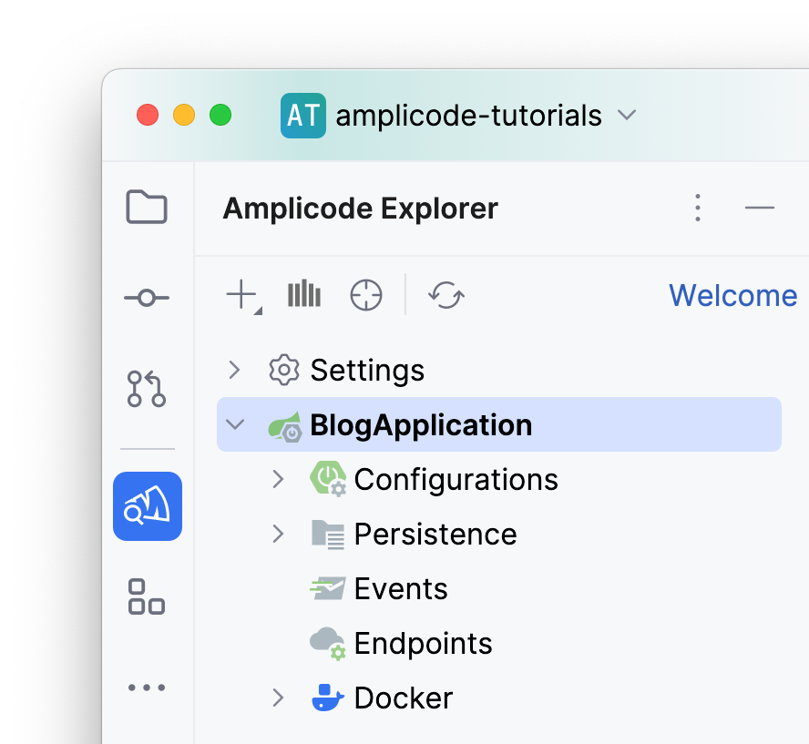

Вы можете продолжать нажимать на стрелочки рядом с различными разделами панели, чтобы получить больше информации:

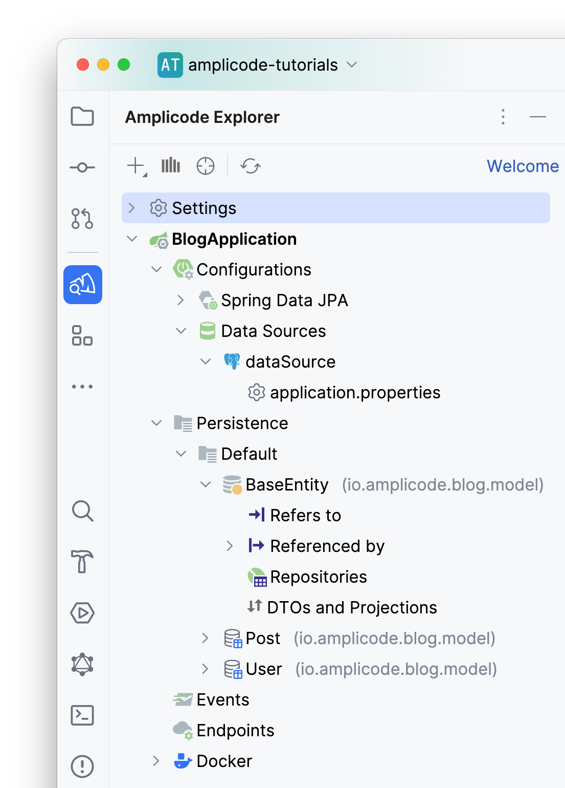

Исходя из знаний Amplicode о нашем проекте, мы можем сделать следующие выводы:
1. Для удобной работы с персистентным слоем в приложении используется модуль Spring Data JPA:
   
2. В качестве СУБД используется PostgreSQL.
3. Мы можем более детально ознакомиться с моделью данных нашего приложения.
  * В качестве базовой для всех сущности используется mapped superclass `BaseEntity`.
  * Сущности `Post` и `User` связаны отношением "многие к одному".
    
4. Наконец, мы можем посмотреть на `docker compose` файлы и их элементы.
   

## Подключение и настройка Flyway к приложению

Первая задача — это подключение и настройка Flyway к Spring Boot приложению с уже разработанной ранее JPA моделью. В процессе решения этой задачи, помимо добавления необходимой зависимости и настройки файла `application.properties`, нам также потребуется создать скрипт инициализации базы данных.

Для взаимодействия с PostgreSQL было бы удобно иметь также сервис pgAdmin. Amplicode предлагает pgAdmin в списке рекомендуемых сервисов, так как видит сервис PostgreSQL в текущем файле. Чтобы воспользоваться этой возможностью, нажмите на иконку в виде лампочки и выберите **Add pgAdmin service** в появившемся меню:


Откроется всплывающий диалог **Add pgAdmin to Docker Compose**. Чтобы воспользоваться предоставленной Amplicode возможностью для настройки автоматического подключения PostgreSQL к pgAdmin:

* Отметьте чекбокс **Configure DB server connections**
  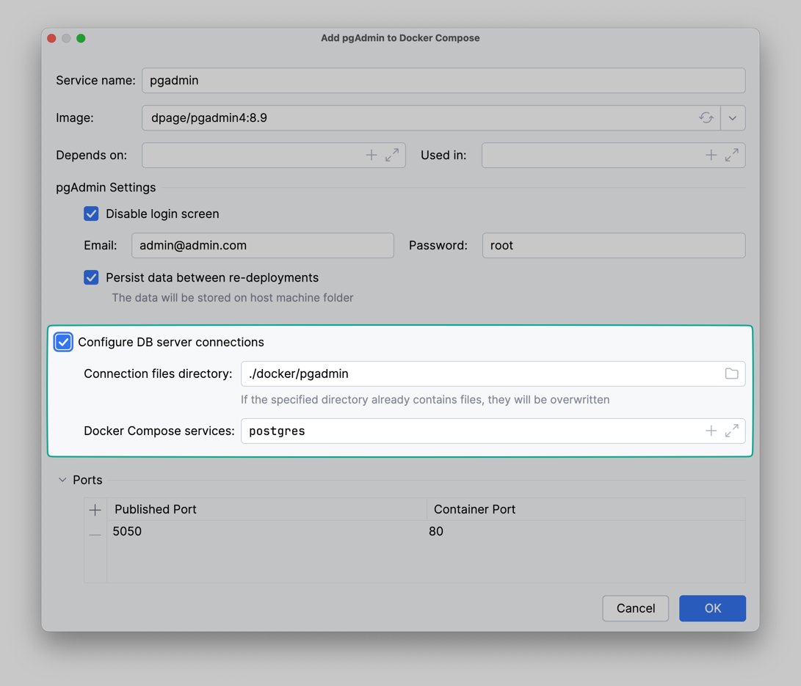
* Оставьте значения всех остальных параметров по умолчанию
* Нажмите **OK**.

Теперь необходимо запустить все сервисы, чтобы посмотреть на актуальное состояние БД. Для этого необходимо нажать на иконку двойной стрелочки напротив слова `services` в файле `docker-compose.yaml`


После запуска Amplicode добавит inlay для удобного открытия адреса, связанного с сервисом, прямо из IntelliJ IDEA.

<!-- This pic needs a replacement -->


На данный момент база данных находится в том же состоянии, что и JPA модель. Переходим к подключению Flyway к нашему приложению.

Amplicode Explorer позволяет добавить необходимые стартеры и библиотеки к проекту. Для этого необходимо:
* Щелкнуть правой кнопкой мыши по узлу **Configuration**
* Выбрать опцию **Add Configuration**
  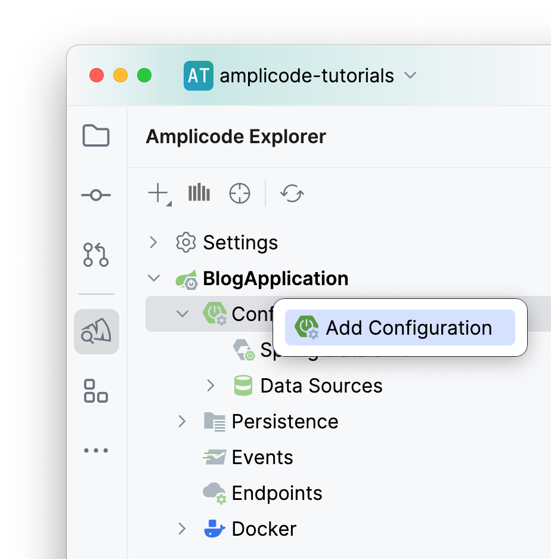
* В открывшемся окне выбрать **DB Migration Configuration**
  
  Откроется диалоговое окно **DB Migration Settings**.
  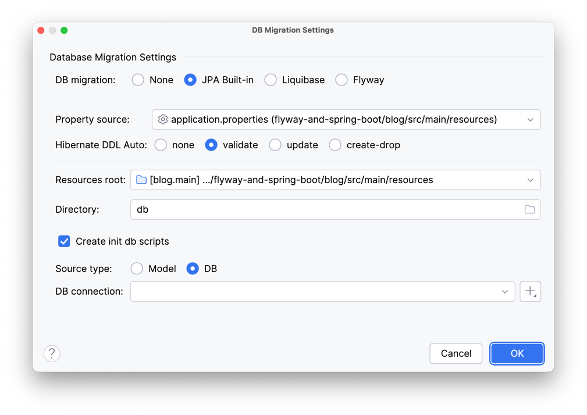

Далее необходимо сделать следующее:
* В открывшемся всплывающем диалоговом окне выбрать **Flyway**


* Оставить выбранный автоматически файл `application.properties`, значения для префикса и сепаратора генерируемых файлов, а также путь, по которому будут сохраняться скрипты миграции, как задано по умолчанию
  


* Отметить чекбоксы **Create init DB scripts** и **Enable baseline on migrate**.


  Благодаря выбору первого чекбокса произойдет автоматическое перенаправление к окну генерации скрипта базы данных. Благодаря выбору второго чекбокса Amplicode добавит свойство в файл `application.properties`, позволяющее запускать приложение и выполнять скрипт инициализации только в том случае, если база данных будет пустой. В остальных случаях скрипт инициализации будет отмечен как выполненный, но фактически выполняться не будет.
* В качестве источника данных для генерации скрипта инициализации выберем базу данных. Для анализа ее структуры Amplicode потребуется подключение к базе данных.

* Выбрать опцию создания нового подключения.
  (Здесь необходимо отметить, что Amplicode позволяет создать подключение к базе данных с нуля, либо отталкиваясь от информации, указанной для источника данных в приложении. Здесь следует выбрать второй вариант, так как источник данных в приложении уже настроен.)
  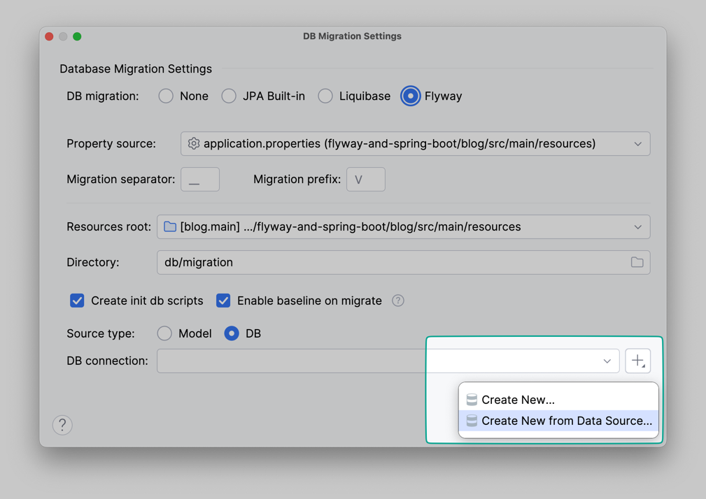

Появится следующее диалоговое окно:


* Нажмите **Create DB Connection**. Теперь вы увидите следующее окно:
  
* Нажмите **Test Connection**, чтобы проверить подключение. После этого нажмите **OK**.
* Нажмите **OK** также в главном диалоговом окне.

* Amplicode добавит необходимые зависимости в `build.gradle` и свойства в `application.properties`, сгенерирует директорию `db.migration` и начнет процесс генерации скрипта инициализации базы данных. В открывшемся окне **Change Preview** мы можем изменить расположение и название `.sql` файла, а также убедиться в корректности всего файла и его отдельных скриптов.

  

* Нажмите **OK**

По результатам выполнения Amplicode сохранит файл миграции по указанному пути. Последнее, что необходимо сделать — это выполнить сгенерированный скрипт. Для этого можно либо запустить приложение целиком, либо настроить Flyway плагин для Gradle и воспользоваться специально предназначенной для выполнения файлов миграции командой `flywayMigrate`. Воспользуемся вторым вариантом.

(Помимо прочих преимуществ, Flyway плагин для Gradle пригодится вам в будущем для настройки CI/CD пайплайна.)

Для этого необходимо:
* Добавить плагин в файл `build.gradle`

`plugins {
id "org.flywaydb.flyway" version "10.15.2"
}`

* Добавить зависимость для работы с PostgreSQL

`dependencies {
runtimeOnly 'org.postgresql:postgresql'
}`

* Указать необходимые параметры для подключения

`  buildscript {
  dependencies {
  classpath("org.flywaydb:flyway-database-postgresql:10.10.0")
  }
  }`

`flyway {
url = 'jdbc:postgresql://localhost:5432/blog'
user = 'root'
password = 'root'
}`

* Выполнить команду `flywayInfo`, чтобы убедиться в корректности работы плагина

* Выполнить команду `flywayBaseline`, чтобы отметить скрипт инициализации как выполненный

По итогу выполненных действий команда будет успешно выполнена, системная таблица Flyway будет добавлена в базу данных, при этом в ней будет содержаться информация о выполненном файле миграции. Выполнение первой задачи на этом завершено.

## Модификация JPA модели

Приступим к модификации текущей JPA модели. Так как использование факса стало редкостью, следует убрать его из модели, удалив следующий (выделенный) код, а также связанные с ним геттер и сеттер:

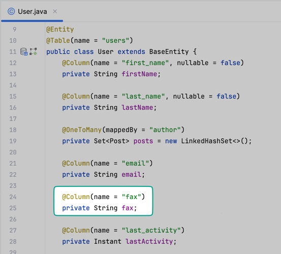

Для обеспечения полноты данных сделаем атрибут `email` обязательным с помощью Amplicode Designer.


Также нам необходимо добавить новую сущность - `Comment` и установить отношение "многие ко многим" с сущностью `Post`.

Предварительно откроем класс сущности `Post`. Чтобы добавить новую сущность - `Comment` и установить отношение "многие ко многим" с сущностью `Post` с помощью Amplicode Designer:
* Откройте окно создания ассоциации двойным щелчком на пункте меню **Attributes** -> **Association** в палитре
  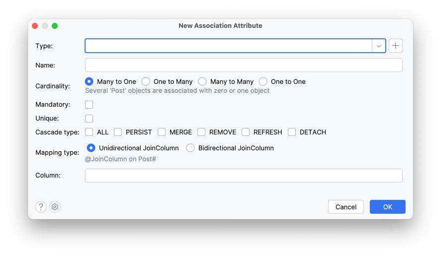
* Создайте новую сущность нажатием на кнопку плюс, укажите ей имя и выберите родительский класс.
  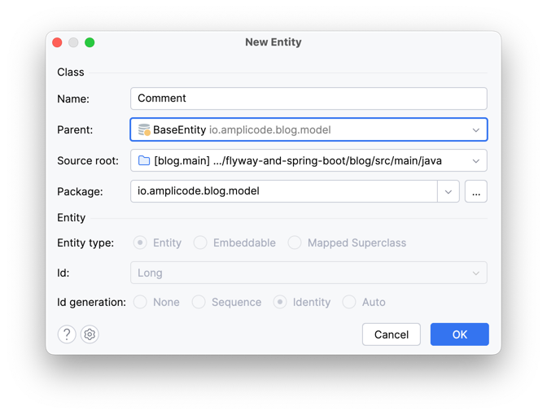
* Измените кардинальность ассоциации на "многие ко многим". Amplicode уже выбрал наиболее оптимальный тип для ассоциации "многие ко многим" — `Set`, но для полностью корректной работы `Set` с JPA сущностями также необходимо чтобы у неё были корректно переопределены методы `equals()` и `hashCode()`. Amplicode знает об этом, и предупреждает, что текущая реализация может быть неоптимальной в плане производительности и предложит сгенерировать реализацию методов `equals()` и `hashCode()`. Чтобы согласиться с этим предложением, нажмите соответствующую ссылку.
  
* Нажмите ОК, чтобы создать соответствующий класс `Comment`.

Теперь необходимо сгенерировать для сущности `Comment` новый базовый атрибут `text`, а также создать отношение "многие к одному" с сущностью `User`. Для этого:
* Установите курсор на имени класса `Comment`  в соответствующем файле
* Вызовите всплывающее окно **Generate**, нажав **Alt+Insert** для Windows/Linux или **⌘+N** для macOS.
  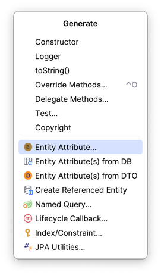
* Выберите **Entity Attribute**
* В окне типа атрибута выберите `Persist` и введите имя типа `User`
  
* Введите тип (**String**) и имя (**text**) для атрибута
  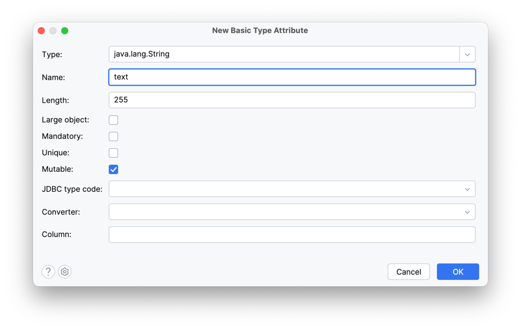
* Нажмите **OK**
* Еще раз вызовите окно **Generate**
* Выберите **Entity Attribute**
* В окне типа атрибута выберите `Persist` и введите имя типа `User`
  
* Задайте название атрибута (`author`) и сделайте его обязательным.
  
* Нажмите **OK**

Задача по модификации JPA модели выполнена. Следующий шаг — генерации скриптов миграции Flyway.

## Генерация Flyway скриптов миграции для синхронизации JPA модели и схемы БД

Для создания Flyway скрипта миграции необходимо обратиться к панели Amplicode Explorer и в секции DB Versioning выбрать пункт **Flyway Versioned Migration**.


В открывшемся окне следует убедиться в правильности выбранных persistence unit и подключения к базе данных.

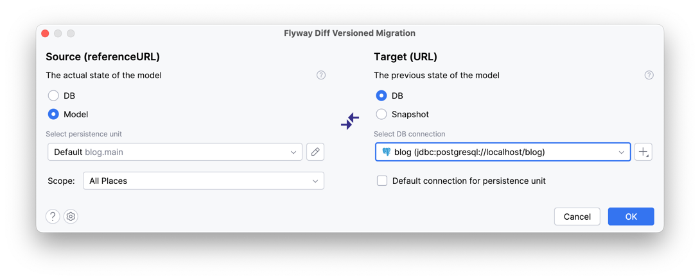

С окном предпросмотра файла миграции мы уже познакомились в процессе создания скриптов инициализации базы данных.


Стоит отметить, что в данном случае цветовая раскраска некоторых скриптов отличается, например, скрипт на удаление колонки `fax` отмечен красным цветом, а скрипт на добавление `NotNull` ограничения — желтым.


Оба скрипта являются потенциально опасными ввиду возможной потери данных, поэтому Amplicode старается обратить на них максимальное внимание со стороны разработчика.

Разрабатывая JPA модель, мы решили две бизнес задачи: изменение сущности `User` и создание сущности `Comment`. Нам бы не хотелось складывать скрипты, относящиеся к разным бизнес задачам, в один файл. Amplicode позволяет разнести скрипты в несколько файлов миграции, не покидая текущего окна.

Для этого необходимо:
* Выбрать скрипты, относящиеся к изменению пользователя
  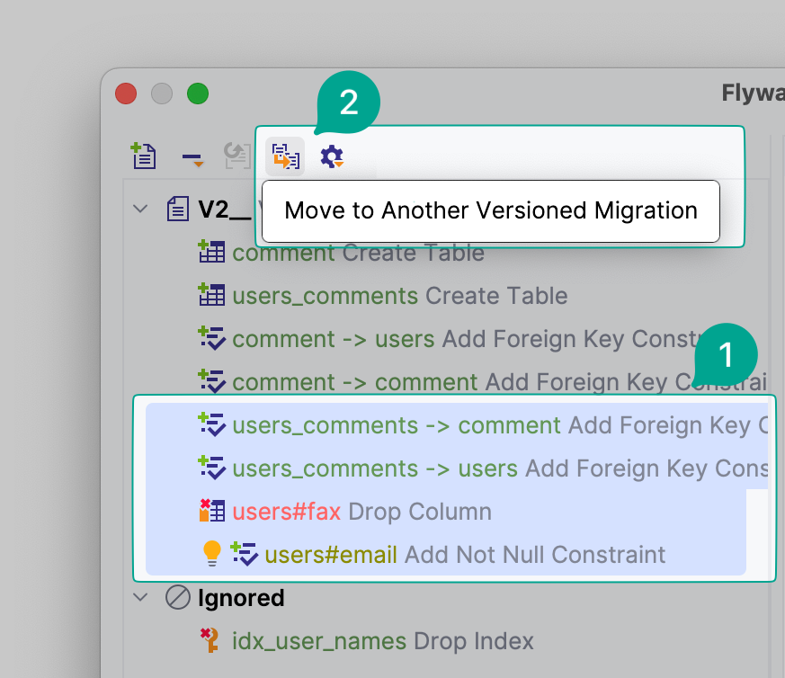
* В верхней панели выбрать действие переноса скриптов в новый файл миграции: ( )

* Задать название каждому из файлов


Также обратите внимание, что для скрипта добавления `NotNull` ограничения Amplicode хочет предложить некоторые улучшения и сигнализирует нам об этом иконкой лампочки. Так как мы добавляем `NotNull` ограничение, мы должны быть уверены в том, что в таблице уже нет `null` значений.

Amplicode позволяет нам улучшить существующий скрипт, указав значение, которое будет проставлено для всех `null` значений перед добавлением ограничения.


Перед сохранением файлов миграции можем еще раз убедиться в их корректности в окне предпросмотра.


Кстати, есть еще один скрипт, который мы упустили. Это скрипт удаления индекса из таблицы `Users`в секции **Ignored**.


Amplicode автоматически разместил этот скрипт в данную секцию, т.к. создание индекса может быть довольно дорогостоящей операцией, а его добавление на уровне JPA модели не является довольно распространенным. Поэтому в реальной жизни удалять его из базы данных приходится крайне редко.

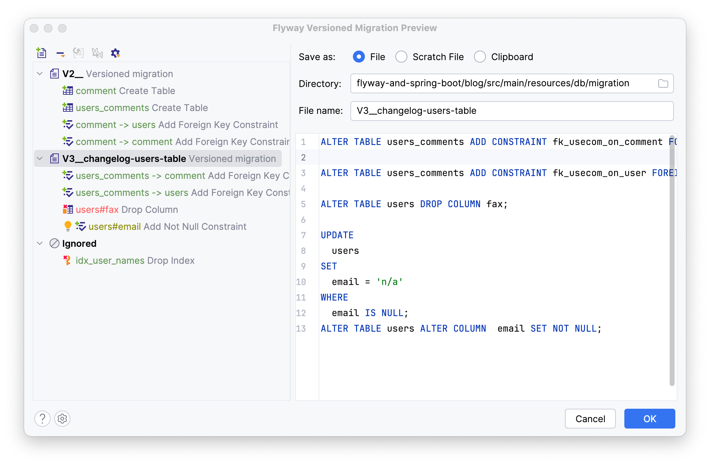

Но в случае необходимости всегда можно удалить скрипт из списка игнорируемых, либо наоборот расширить список игнорируемых скриптов, выбрав и перетащив ненужные скрипты в секцию **Ignored** прямо в окне предпросмотра или сконфигурировав такой список заранее в настройках.

Оба файла миграции успешно сгенерированы. Выполните их, используя команду `flywayMigrate` и проверьте статус исполнения командой `flywayInfo`.

Миграция прошла успешно.


## Запуск Spring Boot приложения (анализ логов от Amplicode)

Хорошей практикой при разработке Spring Boot приложения и использованием системы версионирования баз данных является применение возможностей валидации соответствия JPA модели и схемы базы данных при помощи Hibernate. Путем использования свойства Hibernate `spring.jpa.hibernate.ddl-auto` со значением `validate` мы можем обеспечить соответствие JPA модели и схемы базы данных.

Внесите следующий код в файл `application-properties`:
```asciidoc
spring.jpa.hibernate.ddl-auto=validate
```
Чтобы сделать это быстро, начните печатать `ddl-auto` и Amplicode предложит вам соответствующее свойство. Достаточно будет выбрать его из выпадающего списка и нажать `Enter`.

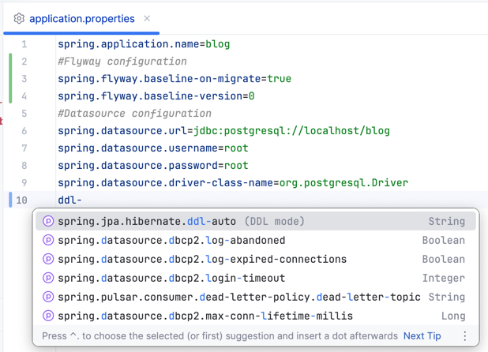

В случае обнаружения несоответствия Spring Boot приложение не запустится и выдаст ошибку.

Запустите приложение, чтобы убедиться, что в логах действительно отсутствуют исключения.

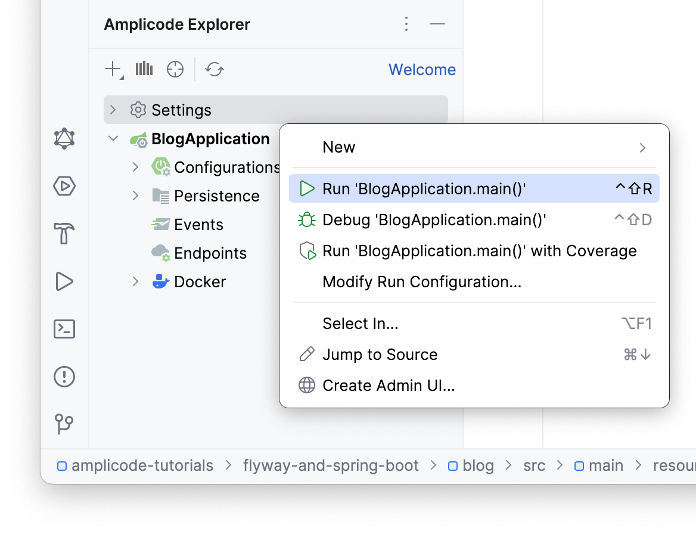

Если приложение запущено без проблем, лог должен выглядеть примерно следующим образом:


Столь же важно отметить, что в случае несоответствия JPA модели и схемы базы данных Amplicode сообщил бы о проблеме и дал бы возможность решить ее прямо из stacktrace.

## Заключение

Подводя итог, все поставленные в данном гайде задачи успешно выполнены примерно за 20 минут.

Вы научились:
1. Подключать и настраивать Flyway в проекте, написанном на Spring Boot с применением Amplicode
2. Расширять JPA модель и писать скрипты миграции БД
3. Валидировать JPA модель и БД

Вы можете установить Amplicode уже сейчас и применить полученные знания на практике.