# Создание Spring Data JPA (Hibernate) сущностей из БД (PostgreSQL, MySQL, Oracle)

[](https://www.youtube.com/watch?v=uxdec6WIWEg)

**Примерное время прочтения: 15 минут.**

Если вы предпочитаете сначала разработать схему базы данных, а затем реализовать JPA модель, или вам необходимо создать приложение поверх уже существующей базы данных, тогда Amplicode станет для вас чрезвычайно удобным инструментом, который сэкономит много времени и избавит от рутинной работы.

Используя действие **JPA Entities from DB**, вы можете преобразовать таблицы базы данных в JPA сущности всего в несколько кликов, учитывая особенности структуры таблиц, такие как ограничения, индексы, свойства столбцов и т.д. Amplicode настолько глубоко понимает вашу модель, что может в подавляющем большинстве случаев правильно определить кардинальность, будь то один к одному, один ко многим, многие к одному или даже многие ко многим. Самое потрясающее в этом всем то, что нам не надо пересоздавать всю сущность, если что-то изменится в схеме базы данных. Вместо этого Amplicode сможет обнаружить, что именно изменилось, и внесет изменения, которые не затронут существующий код. 

Давайте посмотрим на все это в действии. 

## Задачи на сегодня

Сегодня мы будем заниматься разработкой приложения для небольшого блога. В нашей базе данных мы будем хранить пользователей, их посты, комментарии и отображать статистику: количество постов, созданных каждым пользователем. 


Шаги, которые необходимо выполнить в рамках решения поставленной задачи, следующие:

* Инициализация схемы БД
* Создание Spring Boot приложения
* Настройка подключения к БД
* Создание JPA сущностей из таблиц базы данных
* Модификация JPA модели и создание `@MappedSuperclass`
* Cherry-pick изменений из БД в JPA модель
* Создание JPA сущности для DB View

## Инициализация схемы БД

Для первой версии приложения понадобится создать две таблицы: `users` и `posts`. Для этого вам следует выполнить следующие скрипты через pgAdmin.

```sql
CREATE TABLE users
(
    id                  BIGINT GENERATED BY DEFAULT AS IDENTITY NOT NULL,
    created_by          VARCHAR(255),
    created_date        TIMESTAMP WITHOUT TIME ZONE,
    last_modified_by    VARCHAR(255),
    last_modified_date  TIMESTAMP WITHOUT TIME ZONE,
    first_name          VARCHAR(255),
    last_name           VARCHAR(255),
    CONSTRAINT pk_users PRIMARY KEY (id)
);

CREATE TABLE posts
(
    id                  BIGINT GENERATED BY DEFAULT AS IDENTITY NOT NULL,
    created_by          VARCHAR(255),
    created_date        TIMESTAMP WITHOUT TIME ZONE,
    last_modified_by    VARCHAR(255),
    last_modified_date  TIMESTAMP WITHOUT TIME ZONE,
    title               VARCHAR(255),
    test                OID,
    publiched_at        TIMESTAMP WITHOUT TIME ZONE,
    author_id           BIGINT                                  NOT NULL,
    CONSTRAINT pk_posts PRIMARY KEY (id)
);
```

Для улучшения производительности запросов к таблице `users` создайте составной индекс для столбцов имени и фамилии. 

```sql
CREATE INDEX idx_user_names ON "users" (first_name, last_name);
```

Один пользователь может создать несколько постов, поэтому кардинальность отношения будет типа "многие к одному", реализованная через внешний ключ в таблице `posts`. Для ее реализации выполните следующий запрос:

```sql
ALTER TABLE posts
    ADD CONSTRAINT FK_POSTS_ON_AUTHOR FOREIGN KEY (author_id) REFERENCES users (id);
```

После выполнения всех скриптов проверьте актуальное состояние базы данных через pgAdmin, и далее можно будет приступать к разработке собственно Spring Boot приложения. 

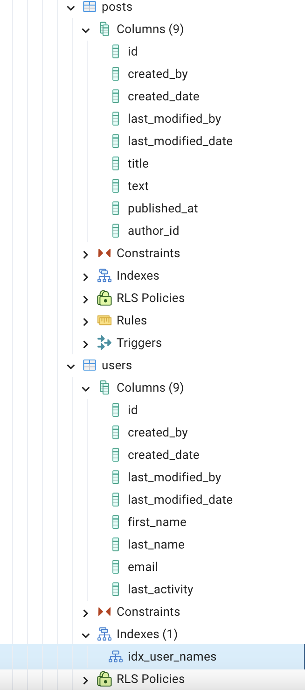

## Создание Spring Boot приложения

Чтобы сгенерировать Spring Boot приложение, воспользуйтесь [Spring Initializr](https://start.spring.io). 

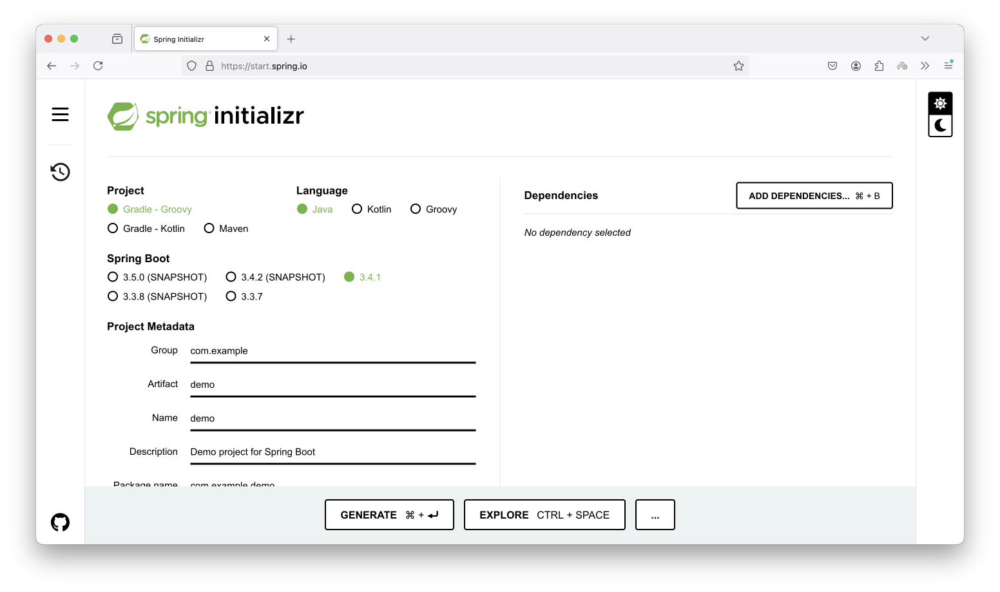

На странице генерации приложения:

* Установите название группы и артефакты 


* Нажмите на ADD DEPENDENCIES


* Добавьте зависимости для Spring Data JPA и PostgreSQL 


* Все остальные настройки оставьте по умолчанию
* Нажмите **GENERATE**


Теперь откройте сгенерированное приложение в IntelliJ IDEA. В момент первого открытия приложения Amplicode необходимо активировать.


После успешной активации все возможности Amplicode станут доступны, и вы сможете увидеть панель Amplicode Explorer в левой нижней части экрана.


## Настройка подключения к БД

Теперь надо настроить источник данных для корректной работы со Spring Data JPA. Amplicode знает, что мы этого еще не сделали, и явно сигнализирует нам об этом. 


С Amplicode настроить источник данных довольно легко: 

* Нажмите правой кнопкой мыши по узлу **Spring Data JPA**  
* Выберите опцию **Create JPA Datasource** 


* В открывшемся окне выберите тип базы данных (PostgreSQL) 


* Укажите необходимые параметры для подключения к источнику данных 


* Благодаря действию **test connection** можно убедиться в корректности указанных параметров для источника данных. 


* Кроме того, имеет смысл сразу же создать подключение к базе данных: для этого отметим чекбокс **Create DB Connection**. 


> Подключение к базе данных необходимо для дальнейшей корректной работы таких возможностей Amplicode как создание сущности на основе таблиц в базе данных, а также генерация скриптов миграции. 

* В диалоге создания подключения оставьте те же значения, которые мы указали для источника данных. 

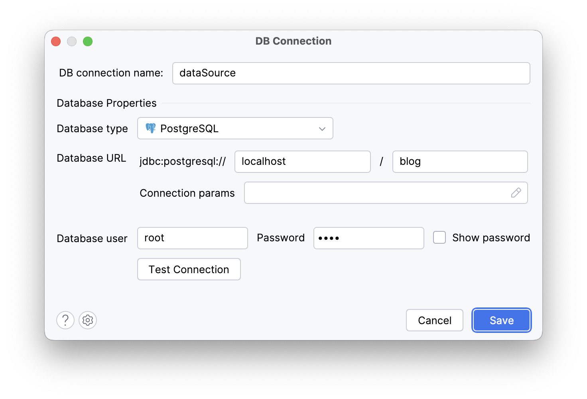

* Нажмите **OK**

Все необходимые параметры для источника данных будут сгенерированы в `application.properties`:

```properties
#Datasource configuration
spring.datasource.url=jdbc:postgresql://localhost/blog
spring.datasource.username=root
spring.datasource.password=root
spring.datasource.driver-class-name=org.postgresql.Driver
```

Также будет создано подключение к нашей базе данных. 


Теперь можно приступать к следующему шагу - разработке JPA модели. 

## Создание JPA сущностей из таблиц базы данных

С помощью Amplicode легко справиться с задачей создания JPA модели, отталкиваясь от существующей базы данных. Для этого:

* В дереве проекта нажмите правую кнопку мыши на имени корневого пакета


* В появившемся всплывающем меню выберите действие **JPA Entities from DB** 

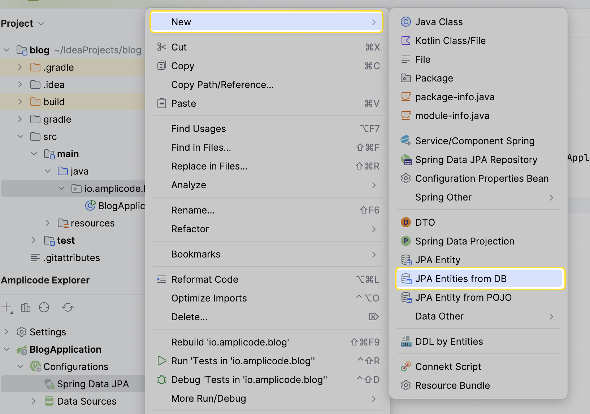

* В открывшемся окне выберите таблицу `posts` 


Amplicode проанализирует структуру таблицы и предложит типы атрибутов сущности, отталкиваясь от типов столбцов таблицы. 


Amplicode прекрасно понимает, что некоторым типам данных в базе данных может соответствовать несколько Java классов, и выбор того или иного типа может отличаться от приложения к приложению. Поэтому Amplicode не ограничивает нас строгим соответствием, а позволяет выбрать один из доступных вариантов там, где это возможно. 


* Для первичного ключа на уровне JPA используйте стратегию **IDENTITY**. 


* Выберите столбец, представляющий собой внешний ключ на таблицу `users`. 


> Amplicode знает, что для реализации ассоциативного атрибута на уровне JPA нам понадобится сущность `User`. Поэтому он автоматически выбирает связанную таблицу. Кроме того, Amplicode позволяет нам создать ассоциативный атрибут "один ко многим" от пользователей к их постам. Подобная связь не может существовать на уровне реляционной базы данных, однако является довольно удобной для JPA модели.

 

Таким образом, в сущности `User` мы можем хранить коллекцию постов, связанных с каждым пользователем. 

```java
    @OneToMany(mappedBy = "author")
    private Set<Post> posts = new LinkedHashSet<>();
```

Стоит отметить, что несмотря на то, что наши таблицы называются во множественном числе, что является довольно распространенным подходом к именованию таблиц на уровне базы данных, на уровне JPA модели принято придерживаться именования в единственном числе. 

```java
public class User extends BaseEntity {
```

Amplicode автоматически установил названия для сущностей в единственном числе. 


Кроме того, в случае необходимости всегда можно изменить эти значения или даже более тонко настроить механизм именования в настройках, сконфигурировав значения полей с префиксами и постфиксами, которые можно будет пропустить при генерации названия сущности или даже через Java код без каких-либо ограничений. 

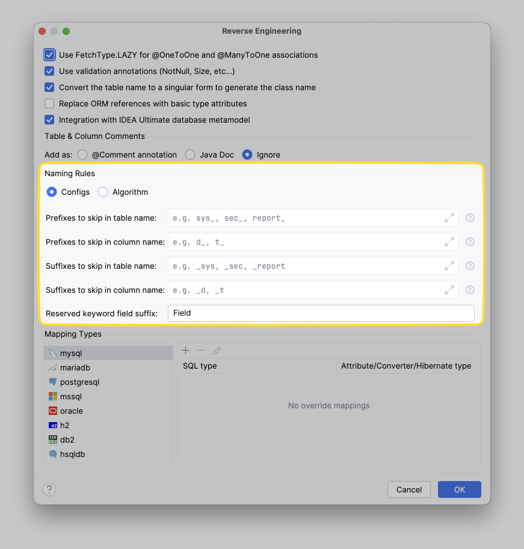

Для этого достаточно лишь воспользоваться ссылкой **Other settings** и выбрать опцию **Reverse Engineering**. 


Как вы помните, у нас также есть индекс для таблицы users в базе данных. Amplicode также может реализовать его на уровне JPA модели. Для миграции существующих индексов и ограничений достаточно выбрать соответствующий чекбокс.

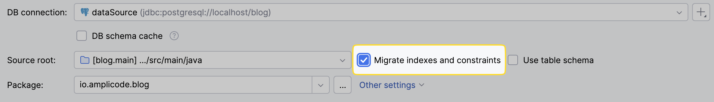

Последним шагом определите отдельный пакет для сущностей, введя его название в поле **Entity package**.  

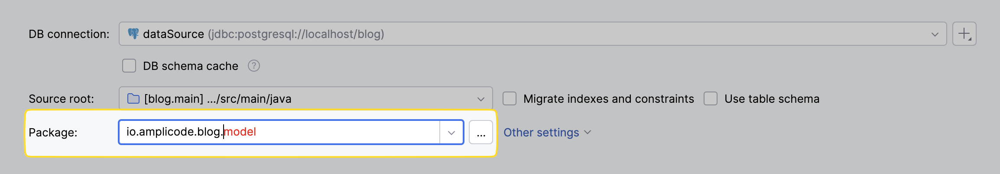

Заполнение формы на этом завершено и теперь необходимо просто нажать **OK**.

Все сущности будут сгенерированы Amplicode вместе с базовыми и ассоциативными атрибутами, а также индексом. Можно переходить к следующему шагу.

## Модификация JPA модели: создание @MappedSuperclass

Прекрасно понимая, что наше приложение со временем будет разрастаться, можно уже сейчас улучшить нашу JPA модель и подготовиться к расширению заранее. Например, идентификатор, а также все поля, связанные с аудитом, например, дата создания и последнего изменения, а также имя пользователя, выполнявшего это самое создание и изменение, будут нужны для подавляющего большинства сущностей. 

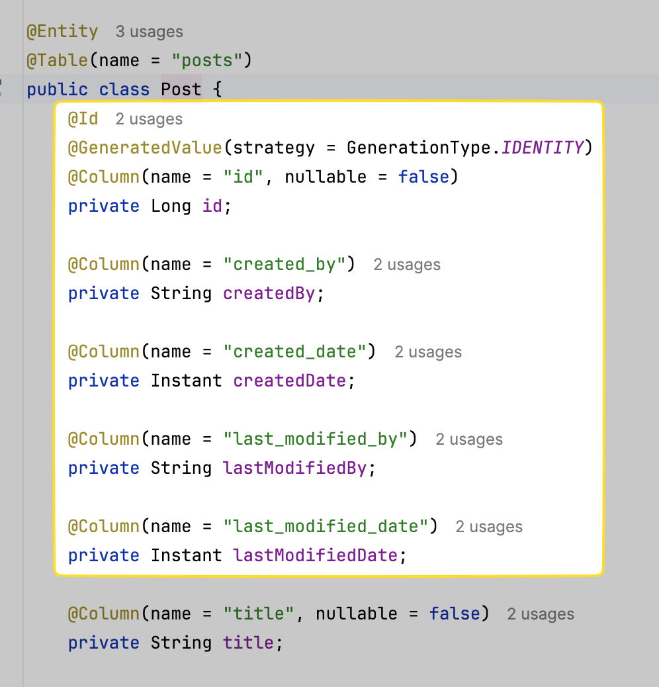

Для решения подобной задачи принято использовать `@MappedSuperclass`, от которого будут унаследованы все остальные сущности. Amplicode позволяет осуществить необходимый рефакторинг предельно удобным образом. 

Прежде всего, воспользуйтесь стандартной комбинацией клавиш для вызова контекстного меню IntelliJ IDEA: **Alt+Enter** для Windows/Linux или **⌥+Enter** для macOS. Далее:

* Выберите опцию **Extract to MappedSuperClass**

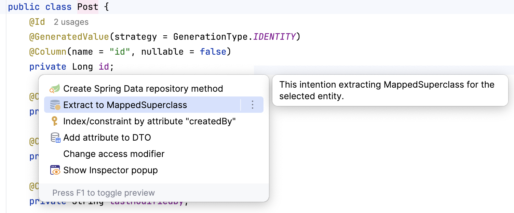

* В появившемся диалоге создания `@MappedSuperclass` зададйте название класса и отметьте все атрибуты, которые нужно вынести в родительский класс


* Нажмите **OK**

`@MappedSuperclass` готов. 

```java
@MappedSuperclass
public class BaseEntity {
    @Id
    @GeneratedValue(strategy = GenerationType.IDENTITY)
    @Column(name = "id", nullable = false)
    private Long id;

    @Column(name = "created_by")
    private String createdBy;

    @Column(name = "created_date")
    private Instant createdDate;

    @Column(name = "last_modified_by")
    private String lastModifiedBy;

    @Column(name = "last_modified_date")
    private Instant lastModifiedDate;

    public Long getId() {
        return id;
    }

    public void setId(Long id) {
        this.id = id;
    }

    public String getCreatedBy() {
        return createdBy;
    }

    public void setCreatedBy(String createdBy) {
        this.createdBy = createdBy;
    }

    public Instant getCreatedDate() {
        return createdDate;
    }

    public void setCreatedDate(Instant createdDate) {
        this.createdDate = createdDate;
    }

    public String getLastModifiedBy() {
        return lastModifiedBy;
    }

    public void setLastModifiedBy(String lastModifiedBy) {
        this.lastModifiedBy = lastModifiedBy;
    }

    public Instant getLastModifiedDate() {
        return lastModifiedDate;
    }

    public void setLastModifiedDate(Instant lastModifiedDate) {
        this.lastModifiedDate = lastModifiedDate;
    }
}
```

Теперь примените аналогичные изменения и к сущности `User`, отредактировав код вручную. Код класса должен приобрести следующий вид:

```java
@Entity
@Table(name = "users", indexes = {
        @Index(name = "idx_user_names", columnList = "first_name, last_name")
})
public class User extends BaseEntity {
    @Column(name = "first_name", nullable = false)
    private String firstName;

    @Column(name = "last_name", nullable = false)
    private String lastName;

    @OneToMany(mappedBy = "author")
    private Set<Post> posts = new LinkedHashSet<>();

    public String getFirstName() {
        return firstName;
    }

    public void setFirstName(String firstName) {
        this.firstName = firstName;
    }

    public String getLastName() {
        return lastName;
    }

    public void setLastName(String lastName) {
        this.lastName = lastName;
    }

    public Set<Post> getPosts() {
        return posts;
    }

    public void setPosts(Set<Post> posts) {
        this.posts = posts;
    }

}
```


## Cherry-pick изменений из БД в JPA модель

Учесть все нюансы, разрабатывая приложение с нуля, довольно сложно. Вот и мы забыли добавить данные об электронной почте пользователя и времени его последней активности. 


Кроме того, мы хотели хранить информацию о комментариях пользователей к постам. 

В соответствии с подходом к разработке "от базы данных", прежде всего добавьте необходимые поля в таблицу `users` и создайте новую таблицу `comments` вместе со связующей таблицей `comments_posts`. 

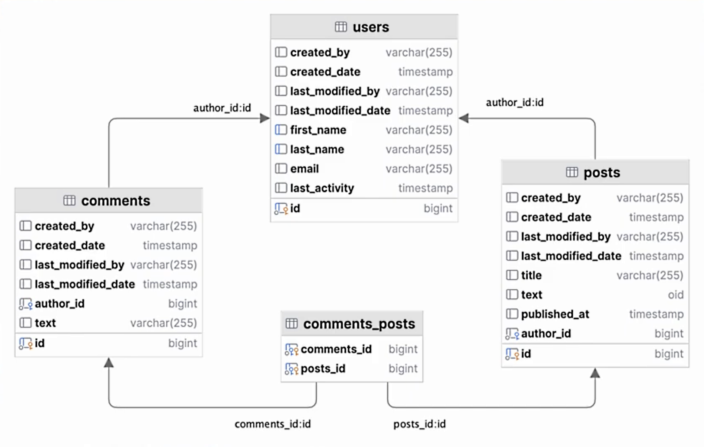

Для этого необходимо выполнить следующие SQL запросы:

```sql
ALTER TABLE users
    ADD email VARCHAR(255);

ALTER TABLE users
    ADD last_activity TIMESTAMP WITHOUT TIME ZONE;


CREATE TABLE comments
(
    id                  BIGINT GENERATED BY DEFAULT AS IDENTITY NOT NULL,
    created_by          VARCHAR(255),
    created_date        TIMESTAMP WITHOUT TIME ZONE,
    last_modified_by    VARCHAR(255),
    last_modified_date  TIMESTAMP WITHOUT TIME ZONE,
    author_id           BIGINT,
    text                VARCHAR(255),
    CONSTRAINT pk_comments PRIMARY KEY (id)  
);

CREATE TABLE comments_posts
(
    comments_id BIGINT NOT NULL,
    posts_id    BIGINT NOT NULL,
    CONSTRAINT pk_comments_posts PRIMARY KEY (comments_id, posts_id)
);

ALTER TABLE comments
    ADD CONSTRAINT FK_COMMENT_ON_AUTHOR FOREIGN KEY (author_id) REFERENCES users (id);

ALTER TABLE comments_posts
    ADD CONSTRAINT fk_compos_on_comments FOREIGN KEY (comments_id) REFERENCES comments (id);

ALTER TABLE comments_posts
ADD CONSTRAINT fk_compos_on_posts FOREIGN KEY (posts_id) REFERENCES posts (id);
```

С Amplicode можно догенерировать недостающие атрибуты в JPA модель, не потеряв при этом уже реализованных изменений.

Можно воспользоваться панелью Generate от IntelliJ IDEA. Для ее вызова следует нажать **Alt+Insert** для Widows/Linux или **⌘+N** для macOS.

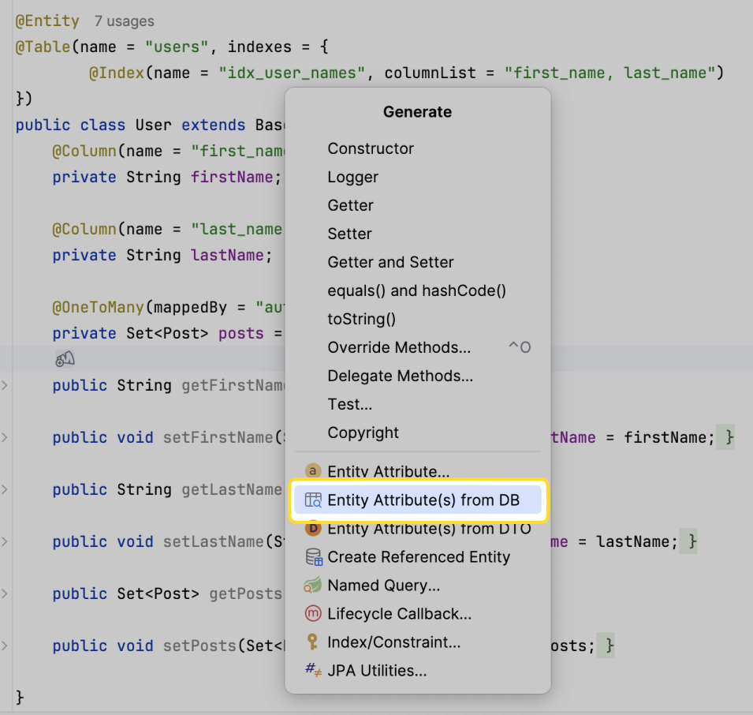

В рамках этой панели для внесения изменений в модель Amplicode предоставляет действие **Entity Attributes from DB**. 

Однако, достичь того же самого результата можно и через уже известное нам диалоговое окно **JPA Entities from DB**, вызываемое из меню **New**, которое появляется при нажатии правой клавиши мыши на дереве проекта. 

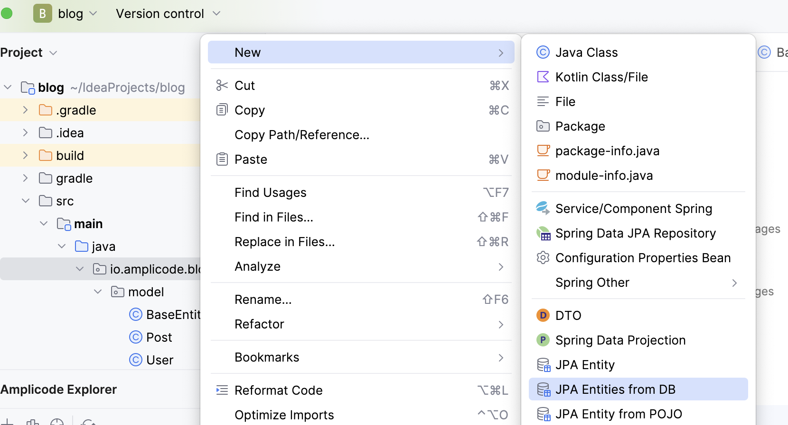

Диалоговое окно **JPA Entities from DB** предоставляет список таблиц, для которых уже есть сущности в проекте. 


Найдите нужную таблицу (`users`) и выберите новые поля, которые надо создать. 

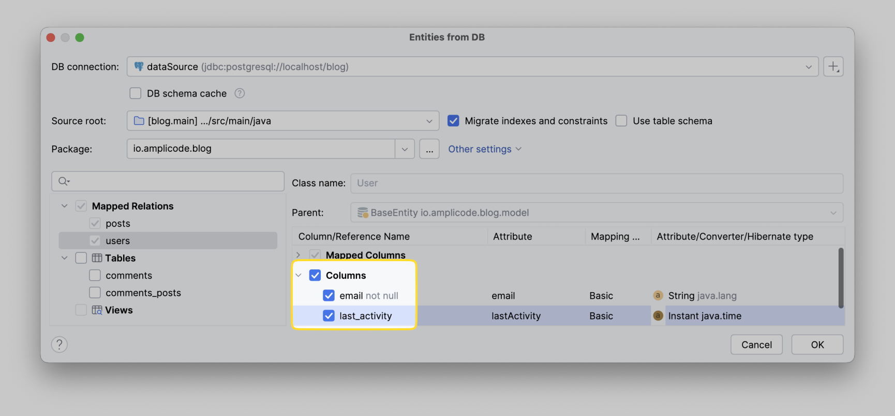

Перейдите к новой таблице `comments`. Для нее мы можем сразу указать родительскую сущность `BaseEntity`. Amplicode отметит те атрибуты, которые будут унаследованы от базового класса. 


Также он корректно определит связь "многие ко многим" между постами и комментариями. 

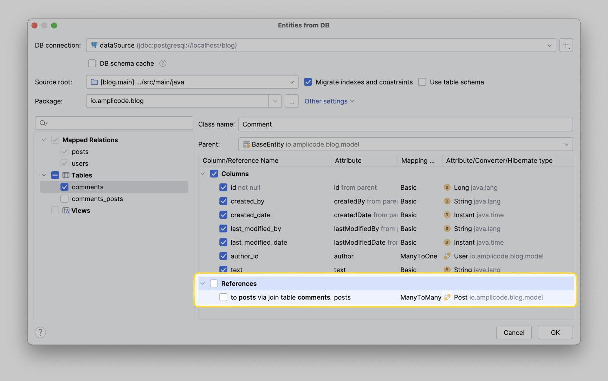

Отметьте чекбокс **to posts via join table com posts**.


Нажмите **OK**. Новая сущность и связь "многие ко многим" будут реализованы. Кроме того, новые атрибуты будут добавлены в уже существующую сущность без изменения ранее написанного кода.

```java
    @Column(name = "email")
    private String email;

    @Column(name = "last_activity")
    private Instant lastActivity;

    public Instant getLastActivity() {
        return lastActivity;
    }

    public void setLastActivity(Instant lastActivity) {
        this.lastActivity = lastActivity;
    }

    public String getEmail() {
        return email;
    }

    public void setEmail(String email) {
        this.email = email;
    }
```

## Создание JPA сущности для DB View

Последнее, что нам осталось сделать сегодня - реализовать агрегацию статистики пользователей. Для этого необходимо создать представление на уровне базы данных, а на уровне JPA модели можно поступить с представлением точно так же, как и до этого с таблицей, что есть создать для него JPA сущность. 

Для создания представления в базе данных выполните следующие SQL запросы:

```sql
CREATE VIEW user_statistics(user_id, number_of_posts) AS
SELECT  u.id            AS user.id,
        count(p.id)     AS number_of_posts
FROM users u
        JOIN posts p ON u.id = p.author_id
GROUP BY u.id;
```

Воспользуйтесь уже знакомым нам диалогом по созданию сущности на основе базы данных и выберите новое представление. 

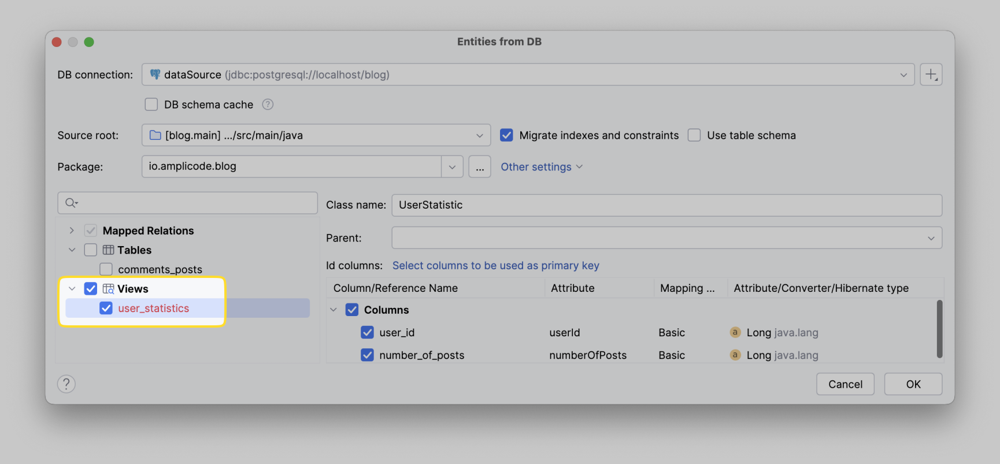

У представлений в базе данных нет первичных ключей, но у сущности JPA должен быть идентификатор. Поэтому нам нужно выбрать поле или набор полей, которые могут выступать в качестве идентификатора сущности. Для этого нажмите на ссылку **Select columns to be used as primary key**. 

Появится всплывающее окно, позволяющее выбрать одно или несколько полей для этой цели. Выберите идентификатор пользователя, так как в данном случае он выглядит как самый подходящий вариант. 


Нажмите **OK** сначала в маленьком окошке, а затем и большом диалоговом окне.

Сущность готова. Так как сохранять данные в представлении напрямую нельзя, необходимо отметить нашу сущность аннотацией `@Immutable`. Amplicode также знает про это и сам добавит необходимую аннотацию. Кроме того, для гарантии невозможности создания новых экземпляров этой сущности Amplicode сгенерирует конструктор без параметров с модификатором `protected`.

Наконец, для всех полей будут сгенерированы только геттеры, чтобы не дать разработчикам возможность изменять значения атрибутов. В целом, сущность представления будет сгенерирована в соответствии со всеми Best Practices. Amplicode заботится о качестве кода за нас:

```java
/**
 * Mapping for DB view
 */
@Entity
@Immutable
@Table(name = "user_statistics")
public class UserStatistic {
    @Id
    @Column(name = "user_id")
    private Long userId;

    @Column(name = "number_of_posts")
    private Long numberOfPosts;

    public Long getUserId() {
        return userId;
    }

    public Long getNumberOfPosts() {
        return numberOfPosts;
    }

    protected UserStatistic() {
    }
}
```

## Заключение

Подводя итог, все поставленные в данном гайде задачи успешно выполнены примерно за 15 минут. Вы увидели, как Amplicode помогает во время разработки приложения с уже существующей базой данных.

Вы научились:
1. Инициализировать схему БД
2. Настраивать подключения к БД
3. Создавать JPA сущности из таблиц базы данных
4. Модифицировать JPA модель и создавать `@MappedSuperclass`
5. Осуществлять cherry-pick изменений из БД в JPA модель
6. Создавать JPA сущность для DB View

Мы очень надеемся, что эти возможности сделают вашу работу еще более легкой и приятной. Спасибо за прочтение гайда, и подписывайтесь на наш Telegram канал, чтобы узнать еще больше о возможностях Amplicode.

