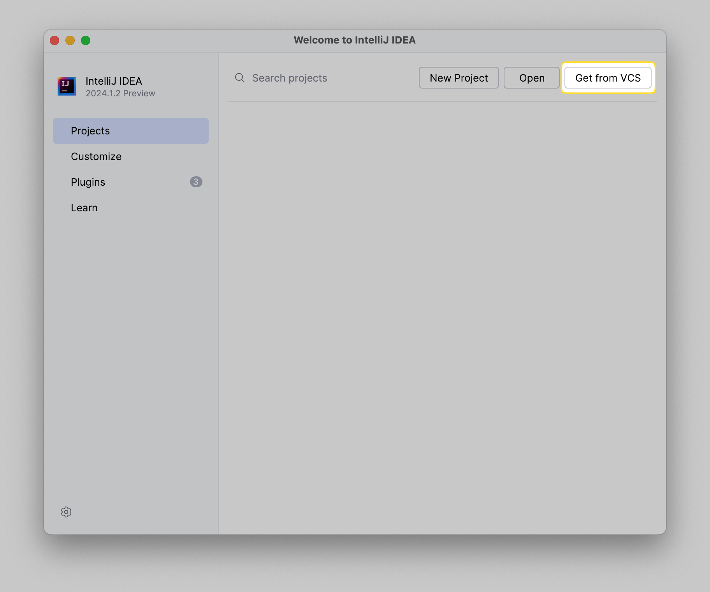
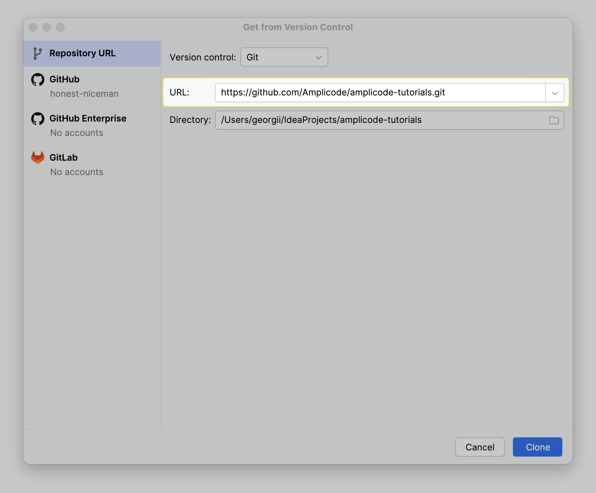
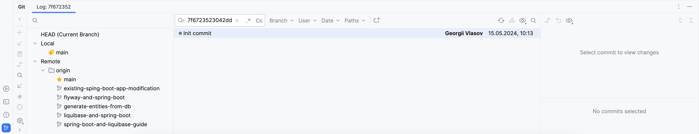
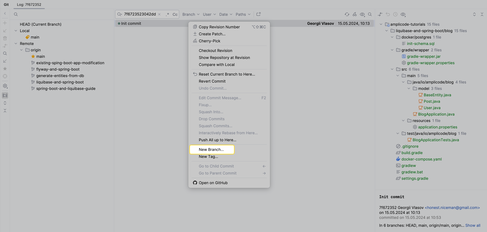
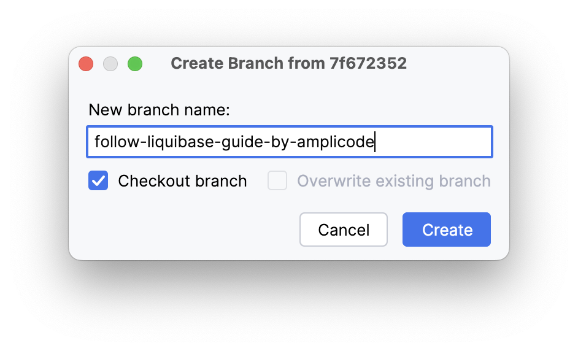
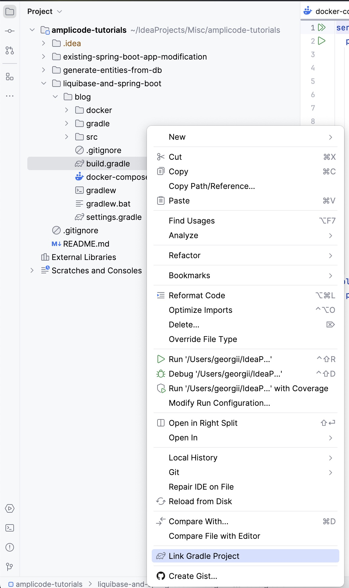

# Liquibase + Spring Boot | Настройка и написание миграций баз данных | Amplicode

[](http://www.youtube.com/watch?v=blAaNt_XHAs)

## Как повторить гайд самостоятельно?

1. Склонируйте репозиторий себе в IntelliJ IDEA. Для этого:
   * Скопируйте следующий URL:
       ```
       https://github.com/Amplicode/amplicode-tutorials.git
       ```
   * Откройте IntelliJ IDEA и нажмите **Get from VCS**
       
   * Вставьте скопированный ранее URL и нажмите **Clone**:
       
2. Откройте панель **Git** (**⌘+9** на MacOS/**Alt+9** на Windows/Linux).
3. В строку поиска вставьте следующий hash: `7f6723523042dd69e8976818fade3772a3a38bc8` и нажмите **Enter**.
    
4. Нажмите правой кнопкой мыши на "Init commit" и выберите пункт **New branch...**:
    
5. В открывшемся окне выберите чекбокс **Checkout branch**, введите любое название и нажмите **Create**:
    
6. Откройте окно **Project** (**⌘+1** на MacOS/**Alt+1** на Windows/Linux)
7. Нажмите правой кнопкой мыши на файл `build.gradle` и выберете пункт **Link Gradle Project**
   
8. Проект готов! Теперь вы можете повторить гайд следуя:
    * Видео: https://youtu.be/blAaNt_XHAs
    * Или текстовому описанию: [//TODO]:#(добавить ссылку)
