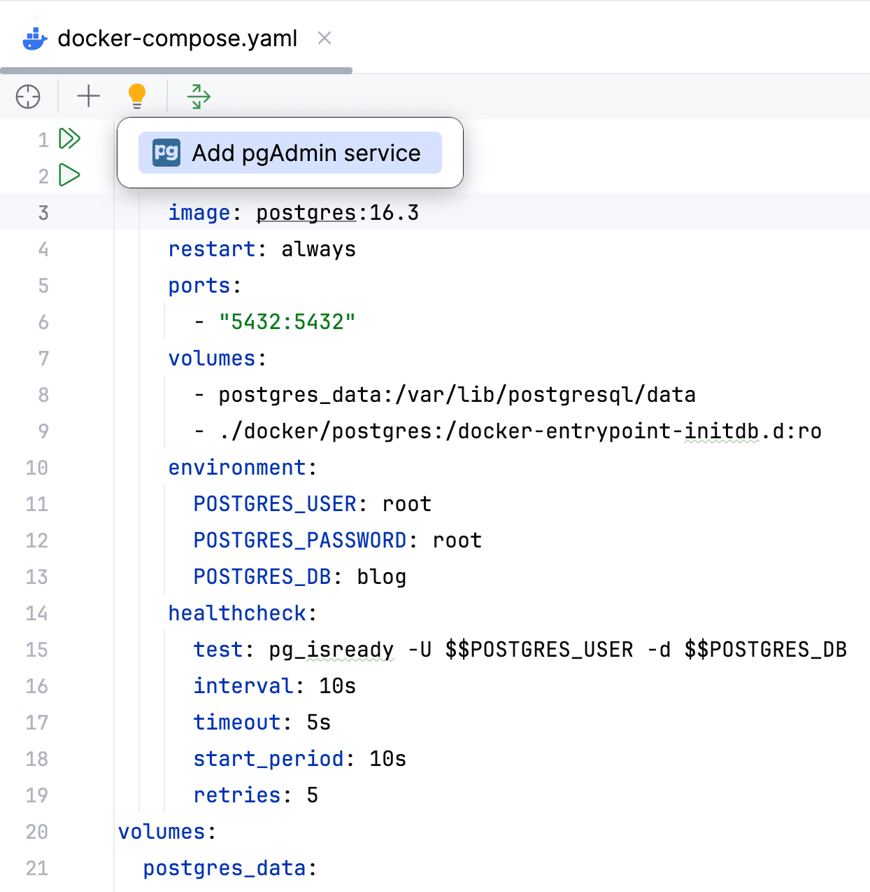

# Liquibase + Spring Boot: Настройка и написание миграций баз данных

**Изучите, как подключить в проект и использовать Liquibase для написания миграционных скриптов баз данных в приложении, написанном на Spring Boot с использованием Amplicode.**

**Примерное время прочтения: 20 минут.**

## Введение
В процессе разработки приложения нам время от времени приходится вносить изменения в JPA модель, что влечет за собой эволюцию схемы БД.

Без использования системы контроля версий существует риск потери данных и возникновения сложностей при совместной работе нескольких разработчиков над проектом. На сегодняшний день наиболее распространенной системой контроля версий является git, который отлично подходит для отслеживания изменений во всех файлах проекта.

Однако, помимо кода, не менее важно версионировать и базу данных, чтобы избежать потери данных при изменениях и иметь возможность отката к предыдущим версиям схемы БД в случае неудачного обновления или ошибки в процессе разработки.

Для эффективного управления версиями базы данных существуют специализированные решения, такие как Liquibase.

Данный гайд посвящен использованию Liquibase в Spring Boot приложениях с помощью Amplicode для наиболее удобного и эффективного управления базами данных.

## Список задач, рассматриваемых в данном гайде
1. Подключение и настройка Liquibase
2. Расширение JPA модели и написание скриптов миграции БД
3. Валидация JPA модели и БД

## Обзор приложения

Прежде чем приступать к решению поставленных задач, необходимо изучить структуру используемого приложения BlogApplicaion с помощью панели Amplicode Explorer. Чтобы открыть данную панель, используйте следующую иконку:   

Панель выглядит следующим образом:

Чтобы проанализировать приложение в контексте используемых фреймворков и библиотек с помощью панели Amplicode Explorer, нажмите на значок стрелочки рябом с именем проекта, чтобы развернуть его. Здесь мы можем узнать, какие модули подключены к нашему проекту, что из себя представляет слой данных, какие эндпонты доступны, а также какие файлы для развертывания приложений уже есть в проекте. 

Вы можете продолжать нажимать на стрелочки рядом с различными разделами панели, чтобы получить больше информации:

Исходя из знаний Amplicode о нашем проекте, мы можем сделать следующие выводы: 
1. Для удобной работы с персистентным слоем в приложении используется модуль Spring Data JPA:
   
2. В качестве СУБД используется PostgreSQL. 
3. Мы можем более детально ознакомиться с моделью данных нашего приложения.
   * В качестве базовой для всех сущности используется mapped superclass `BaseEntity`. 
   * Сущности `Post` и `User` связаны отношением "многие к одному".
   
4. Наконец, мы можем посмотреть на `docker compose` файлы и их элементы.
   

## Подключение и настройка Liquibase к приложению

Первая задача — это подключение и настройка Liquibase к Spring Boot приложению с уже разработанной ранее JPA моделью. В процессе решения этой задачи, помимо добавления необходимой зависимости и настройки файла `application.properties`, нам также потребуется создать скрипт инициализации базы данных.

Для удобного взаимодействия с PostgreSQL желательно наличие сервиса pgAdmin. Amplicode предлагает pgAdmin в списке рекомендуемых сервисов, так как видит сервис PostgreSQL в текущем файле. Чтобы воспользоваться этой возможностью, нажмите на иконку в виде лампочки и выберите **Add pgAdmin service** в появившемся меню:

Откроется вспдывающий диалог **Add pgAdmin to Docker Compose**. Чтобы воспользоваться предоставленной Amplicode возможностью для настройки автоматического подключения PostgreSQL к pgAdmin:

* Пометьте чекбокс **Configure DB server connections**
  
* Оставьте значения всех остальных параметров по умолчанию
* Нажмите **OK**.

Теперь необходимо запустить все сервисы, чтобы посмотреть на актуальное состояние БД. Для этого необходимо нажать на иконку двойной стрелочки напротив слова `services` в файле `docker-compose.yaml`

После запуска Amplicode добавит inlay для удобного открытия адреса, связанного с сервисом, прямо из IntelliJ IDEA. 

На данный момент база данных находится в том же состоянии, что и JPA модель. Переходим к решению поставленной задачи.

Amplicode Explorer позволяет добавить необходимые стартеры и библиотеки к проекту. Для этого достаточно щелкнуть правой кнопкой мыши по узлу Configuration и выбрать опцию Add Configuration. В открывшемся окне мы можем настроить любую из поддерживаемых Amplicode технологий. Выбираем DB Migration Configuration. Выбираем Liquibase. 

Оставим название основного changelog файла, его формат и директорию, где он будет создан, как задано по умолчанию.

Отмечаем чекбоксы Create init DB scripts и Run changelog-sync. Первый чекбокс автоматически перенаправит нас к окну генерации скрипта базы данных. Благодаря второму чекбоксу Amplicode выполнит команду Liquibase `changelog-sync`, котрая позволит отметить скрипты как выполненные, при этом фактически их не выполняя, т.к. все, что в них описано, уже есть в базе данных.

В качестве источника данных для генерации скрипта инициализации выберем базу данных. Для анализа ее структуры Amplicode потребуется подключение к базе данных. Мы можем выюбрать существующее подключение или создать новое. создаем новое подключение.

Amplicode позволяет создать подключение к базе данных с нуля, либо отталкиваясь от информации, указанной для источника данных в приложении. Выбираем второй вариант, так как источних данных в приложении у нас уже настроен. Проверяем подключение и завершаем настройку Liquibase.

Amplicode уже добавил необходимые зависимости и свойства в `application.properties`, сгенерировал файл `db.changelog-master.xml` и начал процесс генерации скрипта инициализации базы данных. В открывшемся окне мы можем изменить расположение, тип и другие параметры файла, а также убедаться в корректности всего файла и его отдельных changeset'ов. Нажмите ОК. Amplicode сохранит changelog по указанному пути и выполнит команду `changelog-sync`, т.к. ранее мы отметили соответствующий checkbox. 

Команда успешно выполнена, системные таблицы Liquibase добавлены в базу данных, а таблица `databasechangelog` содержит информацию о выполненных скриптах. Теперь мы можем двигаться дальше.

## Модификация JPA модели

Приступим к модификации текущей JPA модели. Так как использование факса стало редкостью, мы убираем его из модели, а для обеспечения полноты данных сделаем атрибут `email` обязательным с помощью Amplicode Designer. Также нам необходимо добавить новую сущность - `Comment` и установить отношение "многие ко многим" с сущностью `Post`. 

С помощью Amplicode Designer мы можем выполнить оба эти действия. Для этого откроем окно создания ассоциаци и прямо отсюда создадим новую сущность, указав ей имя и выбрав родительский класс. Затем изменим кардинальность ассоциации на "многие ко многим". Amplicode предупреждает, что текущая реализация может быть неоптимальной в плане производительности и предлагает сгенерировать реализацию методов `equals()` и `hashCode()`. Чтобы согласиться с этим предложением, нажмите соответствующую ссылку. Затем нажмите ОК, чтобы создать соответствующий класс `Comment`. 

Давайте сгенерируем для сущности `Comment` новый базовый атрибут `text`, а также создадим отношение "многие к одному" с сущностью `User`. Зададим название атрибута (`author`) и сделаем его обязательным. Задача по модификации JPA модели выполнена. Теперь перейдем к генерации скриптов миграции Liquibase.

## Генерация Liquibase скриптов миграции для синхронизации JPA модели и схемы БД

Для создания Liquibase скрипта миграции обратимся к панели Amplicode Explorer и в секции DB Versioning выберем пункт Liquibase Diff Changelog.

В открывшемся окне убедимся в правильности выбранных persistence unit и подключения к базе данных. С окном предпросмотра changelog файлов мы уже познакомились в процессе создания скрипта инициализации базы данных. Стоит отметить, что в данном случае цветовая раскраска некоторых changest отличается, например, скрипт на удаление колонки `fax` отмечен красным цветом, а скрипт на добавление `NotNull` ограничения — желтым. Оба скрипта являются потенциально опасными ввиду возможной потери данных, поэтому Amplicode старается обратить на них максимальное внимание со стороны разработчика.

Разрабатывая JPA модель, мы решили две бизнес задачи: изменение сущности `User` и создание сущности `Comment`. Нам бы не хотелось складывать скрипты, относящиеся к разным бизнес задачам, в один файл. Amplicode позволяет разнести changeset файлы в несколько changelog файлов, не покидая текущего окна. 

Для этого выберем скрипты, относящиеся к изменению пользователя, и в верхней панели выберем действие переноса скриптов в новый changelog файл. Зададим название каждому из changelog файлов, а для файла модификации со скриптами таблицы `users` также изменим путь к файлу и укажем главный changelog, в который нужно будет включить текущий файл. Также обратим внимание, что для скрипта добавления `NotNull` ограничения Amplicode хочет предложить некоторые улучшения и сигнализирует нам об этом иконкой лампочки. Так как мы добавляем `NotNull` ограничение, мы должны быть уверены в том, что в таблице уже нет `null` значений. 

Amplicode позволяет нам улучшить существующий скрипт, указав значение, которое будет проставлено для всех `null` значений перед добавлением ограничения. 

Перед сохранением changelog файлов можем еще раз убедиться в их корректности в окне предпросмотра. 

Кстати, есть еще один скрипт, который мы упустили. Это скрипт удаления индекса из таблицы `Users`в секции Ignored. Amplicode автоматически разместил этот скрипт в данную секцию, т.к. создание индекса может быть довольно дорогостоящей операцией, а его добавление на уровне JPA модели не является довольно распространенным. Поэтому в действительности удалять его из базы данных мы вряд ли захотим.

Но в случае необходимости мы всегда можем удалить скрипт из списка игнорируемых, либо наоборот расширить список игнорируемых скриптов, выбрав и перетащив ненужные скрипты в секцию Ignored прямо в окне предпросмотра или сконфигурировав такой список заранее в настройках. 

Оба changelog файла усмпешно сгенерировались и были включены в наш основной файл `db.changelog-master.xml`.

Остается только выполнить скрипты и накатить изменения в базу данных. Конечно же, самым правильным подходом к применению скриптов миграции будет настройка Liquibase плагина для Maven или Gradle, т.к. он в любом случае понадобится во время настройки CI/CD пайплайна. Но, чтобы не отвлекаться на эту задачу на данном этапе, можем воспользоваться действием Liquibase Update в Amplicode и накатить скрипты без предварительной настройки плагина, отложив эту задачу на потом. 

Все скрипты выполнились успешно, а информация об их успешном выполнении была записана в таблицу `databasechangelog`. 

## Добавление новых скриптов миграции в существующий файл

Модифицируя JPA модель, мы забыли сделать атрибут `text` для сущности `Comment` обязательным. Исправить эту оплошность довольно легко, но засорять проект множеством Liquibase changelog файлов нам бы не очень хотелось. К тому же, данный скрипт относится именно к changelog файлу, содержащему скрипты, связанные с созданием таблицы `Comments`. Благодаря тому, что Liquibase исполняет и фиксирует исполнение именно changeset'ов, из которых состоит changelog файл, а не исполнение всего changelog файла целиком, мы можем дополнить существующие changelog файлы новыми changeset'ами. Amplicode хорошо знает про подобную возможность и позволяет догенерировать необходимые скрипты в существующий файл. 

Для этого обратимся к меню Generate от IntelliJ IDEA и выберем пункт Liquibase Diff Changes от Amplicode.

Отлично! Новый changeset добавлен в существующий changelog файл. Осталось только накатить изменения и проверить таблицу `databasechangelog`.

## Запуск Spring Boot приложения (анализ логов от Amplicode)

Хорошей практикой при разработке Spring Boot приложения и использованием системы версионирования баз данных является применение возможновтей валидации соответствия JPA модели и схемы базы данных при помощи Hybernate. Путем использования свойства Hybernate `ddl-auto` со значением `validate` мы можем обеспечить соответствие JPA мл=одели и схемы базы данных. В случае обнаружения несоответствия Spring Boot приложение не запустится и выдаст ошибку. 

Давайте запустим наше приложение и убедимся, что в логах действительно отсутствуют исключения. 

Столь же важно отметить, что ы случае несоответствия JPA модели и схемы базы данных Amplicode сообщил ьы нам о проблеме и дал бы возможность решить ее прямо из stacktrace.

## Заключение

Подводя итог, мы успешно выполнили все поставленные задачи. Вы можете установить Amplicode уже сейчас и применить полученные знания на практике. 

